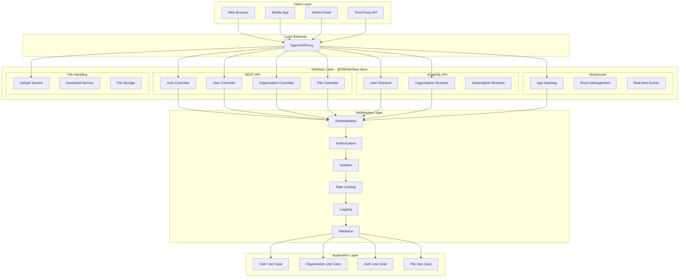
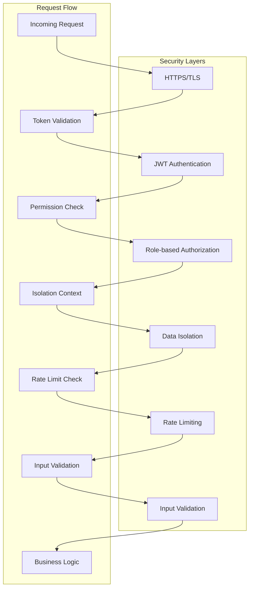
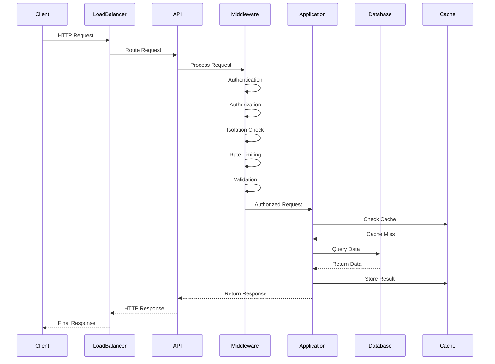
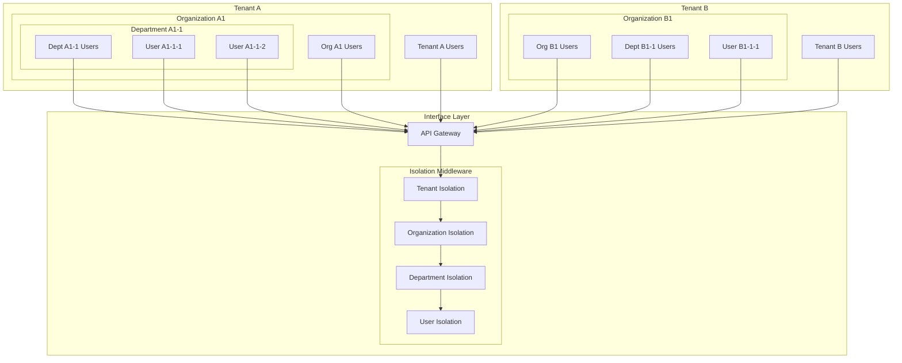
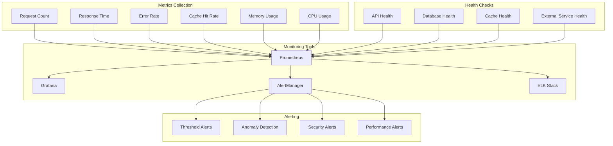
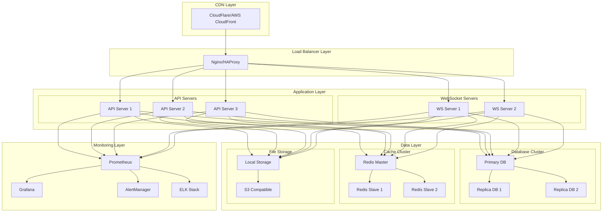
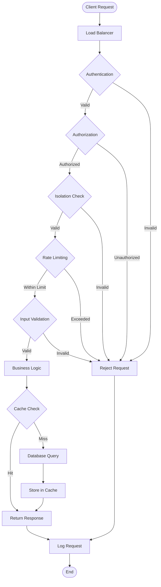
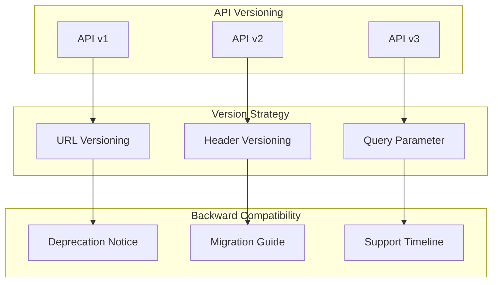

# 接口层架构图

## 🏗️ 整体架构图

## 🔐 安全架构图

## 📊 数据流图

## 🏢 多租户架构图

## 🔧 技术实现图

```mermaid
graph TB
    subgraph "REST API Implementation"
        R1[Fastify Framework]
        R2[Controller Layer]
        R3[Service Layer]
        R4[Repository Layer]
    end
    
    subgraph "GraphQL Implementation"
        G1[Apollo Server]
        G2[Schema Definition]
        G3[Resolver Layer]
        G4[Subscription Layer]
    end
    
    subgraph "WebSocket Implementation"
        W1[Socket.io]
        W2[Gateway Layer]
        W3[Room Management]
        W4[Event Broadcasting]
    end
    
    subgraph "File Handling"
        F1[Multer Middleware]
        F2[File Upload Service]
        F3[File Storage Service]
        F4[File Download Service]
    end
    
    subgraph "Security Implementation"
        S1[JWT Strategy]
        S2[Passport.js]
        S3[Role Guards]
        S4[Permission Guards]
        S5[Isolation Guards]
    end
    
    R1 --> R2
    R2 --> R3
    R3 --> R4
    
    G1 --> G2
    G2 --> G3
    G3 --> G4
    
    W1 --> W2
    W2 --> W3
    W3 --> W4
    
    F1 --> F2
    F2 --> F3
    F3 --> F4
    
    S1 --> S2
    S2 --> S3
    S3 --> S4
    S4 --> S5
```

## 📈 性能监控图

## 🚀 部署架构图

## 🔄 请求处理流程图

## 📊 API 版本管理图

## 🎯 总结

接口层架构图展示了：

1. **整体架构**: 从客户端到数据层的完整架构
2. **安全架构**: 多层安全防护机制
3. **数据流**: 请求处理的完整流程
4. **多租户**: 租户隔离的架构设计
5. **技术实现**: 具体的技术组件和实现
6. **性能监控**: 监控和告警体系
7. **部署架构**: 生产环境的部署方案
8. **请求处理**: 详细的请求处理流程
9. **版本管理**: API 版本控制策略

这些图表为接口层的设计、实现和部署提供了全面的指导。

---

**文档版本**: 1.0.0  
**最后更新**: 2024年12月  
**维护者**: HL8 开发团队
