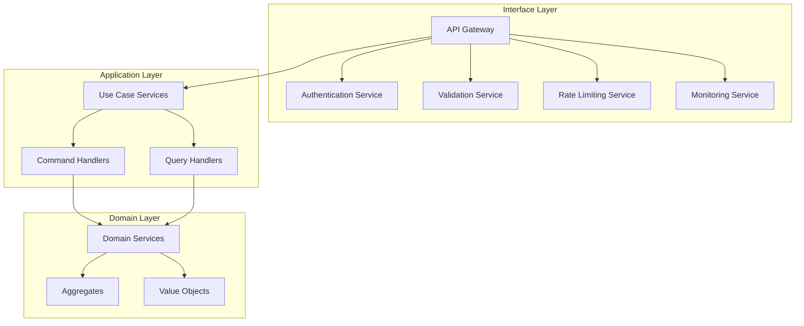

# Interface Layer Technical Plan

**Version**: 1.0.0  
**Last Updated**: 2024-12-19  
**Audience**: Architects, Technical Leads  
**Purpose**: Comprehensive architecture document covering technology choices, design decisions, and integration patterns

## Table of Contents

- [Architecture Overview](#architecture-overview)
- [Technology Stack](#technology-stack)
- [Design Patterns](#design-patterns)
- [Integration Strategies](#integration-strategies)
- [Security Architecture](#security-architecture)
- [Performance Architecture](#performance-architecture)
- [Deployment Architecture](#deployment-architecture)

---

## Architecture Overview

### Interface Layer Purpose

The Interface Layer serves as the entry point for all external interactions with the HL8 AI SAAS Platform. It provides a unified, secure, and scalable interface that abstracts the underlying application and domain layers while maintaining clean architecture principles.

### Core Responsibilities

1. **Request Processing**: Handle incoming requests from various clients (web, mobile, API)
2. **Authentication & Authorization**: Manage user authentication and access control
3. **Data Validation**: Validate and sanitize incoming data
4. **Response Formatting**: Format responses according to client requirements
5. **Error Handling**: Provide consistent error responses and logging
6. **Rate Limiting**: Implement rate limiting and throttling
7. **Monitoring**: Collect metrics and health information

### Architecture Principles

#### Clean Architecture Compliance

- **Dependency Inversion**: Interface layer depends on abstractions, not concretions
- **Separation of Concerns**: Clear separation between presentation, business logic, and data
- **Testability**: All components are easily testable in isolation
- **Maintainability**: Changes to interface layer don't affect business logic

#### Multi-Tenant Architecture

- **Tenant Isolation**: Complete data and process isolation between tenants
- **Shared Resources**: Efficient sharing of infrastructure resources
- **Scalability**: Independent scaling of tenant-specific components
- **Security**: Tenant-specific security policies and access controls

#### Event-Driven Design

- **Asynchronous Processing**: Non-blocking request handling
- **Event Sourcing**: All state changes recorded as events
- **CQRS**: Separate read and write models
- **Event Streaming**: Real-time event processing and notification

### Component Architecture

### Technology Stack Overview

- **Web Framework**: Fastify for high-performance HTTP server
- **GraphQL**: Apollo Server for flexible API queries
- **WebSocket**: Socket.io for real-time communication
- **Authentication**: JWT with Passport.js strategies
- **Validation**: Zod for runtime type validation
- **Monitoring**: Custom metrics and health check endpoints
- **Containerization**: Docker for consistent deployment

## Technology Stack

### Core Technologies

#### Node.js Runtime

- **Version**: Node.js >= 20
- **Rationale**: Latest LTS version with improved performance and security
- **Benefits**:
  - Native ES modules support
  - Enhanced performance with V8 engine updates
  - Improved security features
  - Better TypeScript integration

#### TypeScript

- **Version**: TypeScript 5.9.2
- **Configuration**: NodeNext module system
- **Rationale**: Type safety and enhanced developer experience
- **Benefits**:
  - Compile-time error detection
  - Enhanced IDE support
  - Better refactoring capabilities
  - Improved code documentation

### Web Framework

#### Fastify

- **Version**: Latest stable
- **Rationale**: High-performance HTTP server framework
- **Benefits**:
  - 2x faster than Express.js
  - Built-in JSON schema validation
  - TypeScript support
  - Plugin ecosystem
  - Low overhead

#### Apollo Server

- **Version**: Latest stable
- **Rationale**: Production-ready GraphQL server
- **Benefits**:
  - Schema-first development
  - Built-in caching and performance optimization
  - Real-time subscriptions
  - Developer tools integration
  - Type safety with TypeScript

### Real-time Communication

#### Socket.io

- **Version**: Latest stable
- **Rationale**: Reliable real-time bidirectional communication
- **Benefits**:
  - Automatic fallback to polling
  - Room and namespace support
  - Built-in reconnection logic
  - Cross-browser compatibility
  - Scalable architecture

### Authentication & Security

#### JWT (JSON Web Tokens)

- **Library**: jsonwebtoken
- **Rationale**: Stateless authentication for scalability
- **Benefits**:
  - No server-side session storage
  - Cross-domain compatibility
  - Self-contained token information
  - Industry standard

#### Passport.js

- **Version**: Latest stable
- **Rationale**: Flexible authentication middleware
- **Strategies**:
  - JWT Strategy for API authentication
  - Local Strategy for username/password
  - OAuth2 Strategy for third-party integration
- **Benefits**:
  - Modular authentication strategies
  - Easy integration with Express/Fastify
  - Extensive strategy library
  - TypeScript support

### Data Validation

#### Zod

- **Version**: Latest stable
- **Rationale**: TypeScript-first schema validation
- **Benefits**:
  - Runtime type checking
  - Automatic TypeScript type inference
  - Composable schemas
  - Detailed error messages
  - Zero dependencies

### Development Tools

#### ESLint

- **Configuration**: eslint.config.mjs
- **Rationale**: Code quality and consistency
- **Rules**:
  - TypeScript-specific rules
  - Import/export rules
  - Code style enforcement
  - Security best practices

#### Prettier

- **Configuration**: .prettierrc
- **Rationale**: Consistent code formatting
- **Benefits**:
  - Automatic code formatting
  - IDE integration
  - Team consistency
  - Reduced code review time

### Containerization

#### Docker

- **Version**: Latest stable
- **Rationale**: Consistent deployment environment
- **Benefits**:
  - Environment consistency
  - Easy scaling
  - Simplified deployment
  - Development environment parity

### Package Management

#### pnpm

- **Version**: 10.12.1
- **Rationale**: Fast, disk space efficient package manager
- **Benefits**:
  - Faster installation
  - Disk space efficiency
  - Monorepo support
  - Strict dependency resolution

### Technology Decision Matrix

| Technology    | Performance | Developer Experience | Ecosystem  | Maintenance | Score |
| ------------- | ----------- | -------------------- | ---------- | ----------- | ----- |
| Fastify       | ⭐⭐⭐⭐⭐  | ⭐⭐⭐⭐             | ⭐⭐⭐⭐   | ⭐⭐⭐⭐    | 17/20 |
| Apollo Server | ⭐⭐⭐⭐    | ⭐⭐⭐⭐⭐           | ⭐⭐⭐⭐⭐ | ⭐⭐⭐⭐    | 18/20 |
| Socket.io     | ⭐⭐⭐⭐    | ⭐⭐⭐⭐             | ⭐⭐⭐⭐   | ⭐⭐⭐⭐    | 16/20 |
| JWT           | ⭐⭐⭐⭐⭐  | ⭐⭐⭐⭐             | ⭐⭐⭐⭐⭐ | ⭐⭐⭐⭐⭐  | 20/20 |
| Zod           | ⭐⭐⭐⭐    | ⭐⭐⭐⭐⭐           | ⭐⭐⭐⭐   | ⭐⭐⭐⭐    | 17/20 |

### Migration Strategy

#### From Express to Fastify

1. **Gradual Migration**: Migrate endpoints one by one
2. **Plugin Compatibility**: Ensure existing middleware compatibility
3. **Performance Testing**: Validate performance improvements
4. **Team Training**: Train team on Fastify patterns

#### From CommonJS to NodeNext

1. **File Extensions**: Update all imports to use .js extensions
2. **Package.json**: Set "type": "module"
3. **Import Statements**: Convert require() to import statements
4. **Testing**: Update test configurations for ESM

## Design Patterns

### Clean Architecture Patterns

#### Dependency Inversion Principle

- **Interface Segregation**: Small, focused interfaces
- **Dependency Injection**: Constructor injection for dependencies
- **Abstraction Layers**: Clear separation between layers

#### Repository Pattern

- **Data Access Abstraction**: Abstract data access logic
- **Testability**: Easy mocking for unit tests
- **Flexibility**: Switch between different data sources

#### Command Query Responsibility Segregation (CQRS)

- **Command Side**: Write operations with business logic
- **Query Side**: Read operations optimized for display
- **Event Sourcing**: State changes as event streams

### Event-Driven Patterns

#### Event Sourcing

- **State Reconstruction**: Rebuild state from events
- **Audit Trail**: Complete history of changes
- **Time Travel**: Query state at any point in time

#### Domain Events

- **Business Events**: Domain-specific events
- **Integration Events**: Cross-bounded context events
- **Event Handlers**: Process events asynchronously

#### Saga Pattern

- **Distributed Transactions**: Manage long-running processes
- **Compensation**: Rollback mechanisms
- **Orchestration**: Centralized process coordination

## Integration Strategies

### API Gateway Pattern

- **Single Entry Point**: Centralized request routing
- **Cross-Cutting Concerns**: Authentication, rate limiting, logging
- **Protocol Translation**: HTTP to GraphQL, REST to WebSocket
- **Load Balancing**: Distribute requests across services

### Microservices Communication

- **Synchronous**: HTTP/REST for immediate responses
- **Asynchronous**: Message queues for eventual consistency
- **Event Streaming**: Real-time event propagation
- **Service Discovery**: Dynamic service location

### Data Integration

- **Event Sourcing**: Single source of truth for state changes
- **CQRS**: Separate read and write models
- **Data Projection**: Materialized views for queries
- **Event Replay**: Rebuild read models from events

## Security Architecture

### Authentication Strategies

- **JWT Tokens**: Stateless authentication
- **Multi-Factor Authentication**: Enhanced security
- **OAuth2 Integration**: Third-party authentication
- **Session Management**: Secure session handling

### Authorization Patterns

- **Role-Based Access Control (RBAC)**: User roles and permissions
- **Attribute-Based Access Control (ABAC)**: Context-aware authorization
- **Resource-Based Authorization**: Fine-grained permissions
- **Tenant Isolation**: Multi-tenant security boundaries

### Data Protection

- **Encryption at Rest**: Database and file encryption
- **Encryption in Transit**: TLS/SSL for all communications
- **Data Masking**: Sensitive data protection
- **Audit Logging**: Security event tracking

### Security Monitoring

- **Intrusion Detection**: Anomaly detection
- **Rate Limiting**: DDoS protection
- **Security Headers**: HTTP security headers
- **Vulnerability Scanning**: Regular security assessments

## Performance Architecture

### Caching Strategies

- **Application-Level Caching**: In-memory caching
- **Distributed Caching**: Redis for shared cache
- **CDN Integration**: Static content delivery
- **Database Caching**: Query result caching

### Scalability Patterns

- **Horizontal Scaling**: Multiple server instances
- **Load Balancing**: Request distribution
- **Database Sharding**: Data partitioning
- **Microservices**: Independent service scaling

### Performance Optimization

- **Connection Pooling**: Database connection management
- **Async Processing**: Non-blocking operations
- **Compression**: Response compression
- **Monitoring**: Performance metrics collection

## Deployment Architecture

### Containerization

- **Docker Containers**: Consistent deployment units
- **Container Orchestration**: Kubernetes for scaling
- **Service Mesh**: Inter-service communication
- **Health Checks**: Service health monitoring

### Infrastructure as Code

- **Terraform**: Infrastructure provisioning
- **Helm Charts**: Kubernetes application deployment
- **CI/CD Pipelines**: Automated deployment
- **Environment Management**: Dev, staging, production

### Monitoring and Observability

- **Application Metrics**: Business and technical metrics
- **Distributed Tracing**: Request flow tracking
- **Log Aggregation**: Centralized logging
- **Alerting**: Proactive issue detection

---

**Cross-References**:

- [Implementation Guide](./INTERFACE_LAYER_IMPLEMENTATION_GUIDE.md)
- [Architecture Diagrams](./INTERFACE_LAYER_ARCHITECTURE_DIAGRAM.md)
- [Documentation Index](./ISOLATION_DOCUMENTATION_INDEX.md)
