# 数据隔离架构图

## 🏗️ 整体架构图

```mermaid
graph TB
    subgraph "Application Layer"
        A1[User API]
        A2[Admin API] 
        A3[System API]
    end
    
    subgraph "Framework Layer - @hl8/nestjs-isolation"
        F1[IsolationContextService]
        F2[MultiLevelIsolationService]
        F3[IsolationGuard]
        F4[IsolationExtractionMiddleware]
        F5[@CurrentContext Decorator]
        F6[@RequireLevel Decorator]
    end
    
    subgraph "Infrastructure Layer - @hl8/infrastructure-kernel"
        I1[IsolationContextManager]
        I2[AccessControlService]
        I3[AuditLogService]
        I4[SecurityMonitorService]
        I5[CacheService]
        I6[DatabaseService]
    end
    
    subgraph "Domain Layer - @hl8/domain-kernel"
        D1[IsolationContext Entity]
        D2[IsolationLevel Enum]
        D3[SharingLevel Enum]
        D4[Value Objects]
        D5[Business Rules]
    end
    
    A1 --> F3
    A2 --> F3
    A3 --> F3
    
    F3 --> F2
    F4 --> F1
    F5 --> F1
    F6 --> F3
    
    F1 --> I1
    F2 --> I2
    
    I1 --> D1
    I2 --> D1
    I3 --> D1
    I4 --> D1
    I5 --> D1
    I6 --> D1
    
    D1 --> D2
    D1 --> D3
    D1 --> D4
    D1 --> D5
```

## 🔐 隔离层级图

```mermaid
graph TD
    subgraph "Isolation Levels"
        P[Platform Level<br/>平台级]
        T[Tenant Level<br/>租户级]
        O[Organization Level<br/>组织级]
        D[Department Level<br/>部门级]
        U[User Level<br/>用户级]
    end
    
    P --> T
    T --> O
    O --> D
    D --> U
    
    P -.->|"Can access all"| T
    P -.->|"Can access all"| O
    P -.->|"Can access all"| D
    P -.->|"Can access all"| U
    
    T -.->|"Can access tenant data"| O
    T -.->|"Can access tenant data"| D
    T -.->|"Can access tenant data"| U
    
    O -.->|"Can access org data"| D
    O -.->|"Can access org data"| U
    
    D -.->|"Can access dept data"| U
```



## 🔄 数据流图


## 🛡️ 权限控制流图


## 🏢 多租户架构图


## 🔧 技术实现图


## 📊 性能监控图


## 🔒 安全架构图


## 🚀 部署架构图


---

**文档版本**: 1.0.0  
**最后更新**: 2024年12月  
**维护者**: HL8 开发团队
