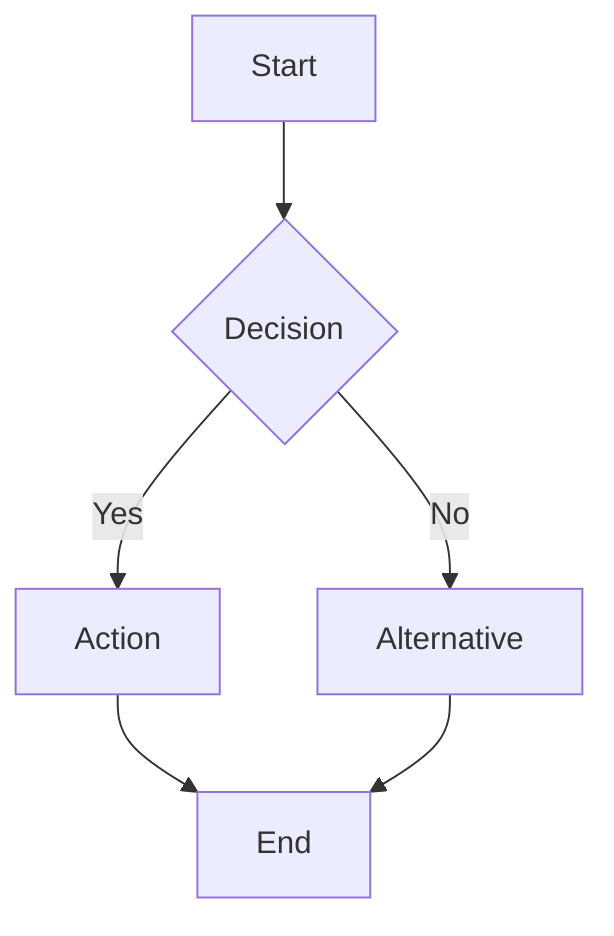

# Documentation Style Guide

**Purpose**: Style guidelines and templates for interface layer documentation

## Document Structure

### Header Template

```markdown
# [Document Title]

**Version**: [Semantic Version]  
**Last Updated**: [Date]  
**Audience**: [Target Audience]  
**Purpose**: [Brief description]

## Table of Contents

- [Section 1](#section-1)
- [Section 2](#section-2)
- [Section 3](#section-3)
```

### Footer Template

```markdown
---

**Cross-References**:
- [Related Document 1](./RELATED_DOCUMENT_1.md)
- [Related Document 2](./RELATED_DOCUMENT_2.md)
- [Documentation Index](./ISOLATION_DOCUMENTATION_INDEX.md)
```

## Writing Guidelines

### Language and Tone

- **Language**: Use clear, concise English
- **Tone**: Professional and accessible
- **Audience**: Write for the target audience
- **Clarity**: Avoid jargon and technical complexity

### Content Structure

- **Headings**: Use descriptive headings
- **Sections**: Organize content logically
- **Lists**: Use bullet points and numbered lists
- **Code**: Use code blocks with syntax highlighting
- **Diagrams**: Include visual representations

### Code Examples

```typescript
// Example: TypeScript code with comments
interface UserService {
  findById(id: string): Promise<User>;
  create(user: CreateUserRequest): Promise<User>;
  update(id: string, user: UpdateUserRequest): Promise<User>;
}
```

### Mermaid Diagrams



## Formatting Standards

### Headers

- **H1**: Document title only
- **H2**: Major sections
- **H3**: Subsections
- **H4**: Minor sections

### Lists

- **Bullet Points**: For unordered items
- **Numbered Lists**: For sequential steps
- **Nested Lists**: For hierarchical information

### Tables

| Column 1 | Column 2 | Column 3 |
|----------|----------|----------|
| Data 1   | Data 2   | Data 3   |
| Data 4   | Data 5   | Data 6   |

### Code Blocks

- **Language**: Specify programming language
- **Syntax**: Use proper syntax highlighting
- **Comments**: Include explanatory comments
- **Examples**: Provide working examples

## Quality Standards

### Content Quality

- **Accuracy**: All information must be accurate
- **Completeness**: Cover all necessary topics
- **Clarity**: Write for the target audience
- **Consistency**: Maintain consistent style

### Technical Quality

- **Code Examples**: Must be syntactically correct
- **Diagrams**: Must be valid Mermaid.js syntax
- **Links**: All links must be valid
- **References**: All references must be accessible

### Maintenance

- **Version Control**: All changes tracked in Git
- **Review Process**: Content reviewed before publication
- **Update Schedule**: Regular review and updates
- **Ownership**: Clear responsibility for each document

## Templates

### Technical Document Template

```markdown
# [Document Title]

**Version**: 1.0.0  
**Last Updated**: [Date]  
**Audience**: [Target Audience]  
**Purpose**: [Brief description]

## Table of Contents

- [Section 1](#section-1)
- [Section 2](#section-2)

## Section 1

[Content]

## Section 2

[Content]

---

**Cross-References**:
- [Related Document](./RELATED_DOCUMENT.md)
```

### Implementation Guide Template

```markdown
# [Implementation Guide Title]

**Version**: 1.0.0  
**Last Updated**: [Date]  
**Audience**: Developers  
**Purpose**: Step-by-step development instructions

## Table of Contents

- [Setup Instructions](#setup-instructions)
- [Code Examples](#code-examples)
- [Testing Procedures](#testing-procedures)

## Setup Instructions

[Step-by-step instructions]

## Code Examples

[Working code examples]

## Testing Procedures

[Testing instructions]

---

**Cross-References**:
- [Technical Plan](./TECHNICAL_PLAN.md)
- [Architecture Diagrams](./ARCHITECTURE_DIAGRAMS.md)
```

---

**Last Updated**: 2024-12-19  
**Version**: 1.0.0
