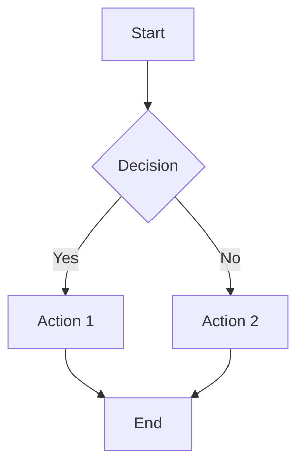
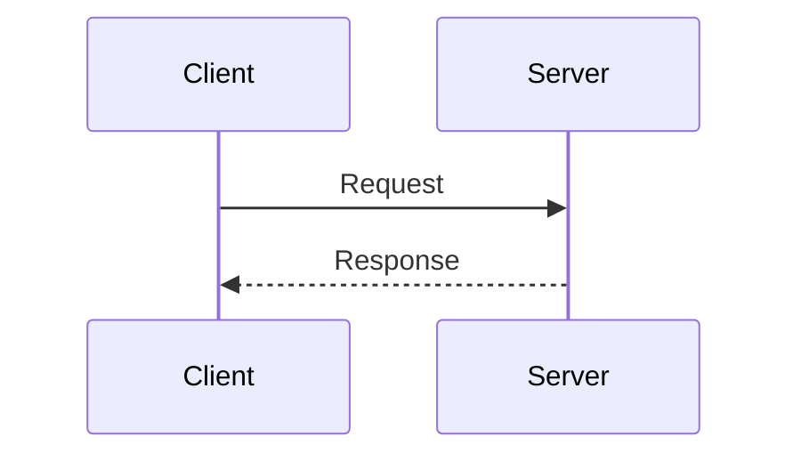
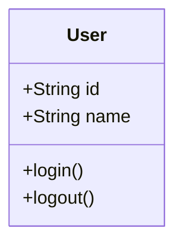

# Mermaid.js Configuration

**Purpose**: Configuration and validation for Mermaid.js diagrams in interface layer documentation

## Supported Diagram Types

- **Flowcharts**: System architecture and process flows
- **Sequence Diagrams**: Component interactions and workflows
- **Class Diagrams**: Object relationships and inheritance
- **State Diagrams**: System state transitions
- **Entity Relationship Diagrams**: Data model relationships
- **User Journey Diagrams**: User interaction flows
- **Gantt Charts**: Project timelines and dependencies
- **Pie Charts**: Data distribution and statistics

## Diagram Syntax Validation

### Flowchart Syntax

### Sequence Diagram Syntax

### Class Diagram Syntax

## Validation Rules

1. **Syntax Validation**: All Mermaid diagrams must use valid syntax
2. **Consistency**: Diagram styling must be consistent across all documents
3. **Accessibility**: Diagrams must be readable and accessible
4. **Version Control**: All diagrams must be version-controlled with Git

## Best Practices

1. **Naming**: Use descriptive names for nodes and participants
2. **Layout**: Keep diagrams simple and focused
3. **Colors**: Use consistent color schemes
4. **Legends**: Include legends for complex diagrams
5. **Documentation**: Provide descriptions for each diagram

## Troubleshooting

### Common Issues

- Invalid syntax: Check Mermaid.js documentation
- Rendering issues: Verify diagram syntax
- Layout problems: Adjust diagram structure
- Performance issues: Optimize diagram complexity

### Validation Tools

- Mermaid.js Live Editor: <https://mermaid.live/>
- VS Code Mermaid Extension
- GitHub Mermaid Support
- GitLab Mermaid Support

---

**Last Updated**: 2024-12-19  
**Version**: 1.0.0
