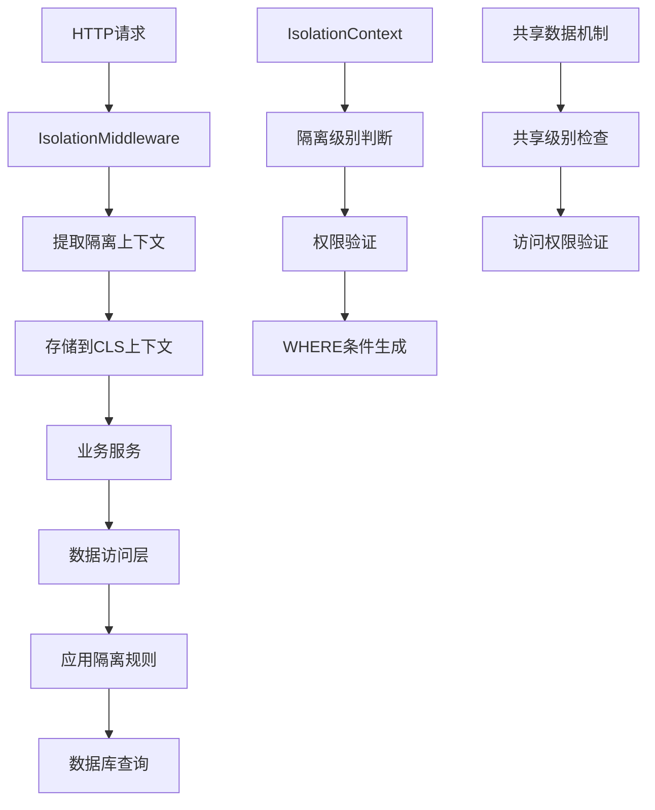

# HL8 SAAS平台数据隔离机制培训文档

## 📋 目录

1. [概述](#概述)
2. [数据隔离架构](#数据隔离架构)
3. [隔离级别详解](#隔离级别详解)
4. [核心组件](#核心组件)
5. [实际应用场景](#实际应用场景)
6. [代码示例](#代码示例)
7. [最佳实践](#最佳实践)
8. [常见问题](#常见问题)
9. [故障排查](#故障排查)

---

## 概述

### 什么是数据隔离？

数据隔离是SAAS平台的核心安全机制，确保不同租户、组织、部门或用户的数据完全分离，防止数据泄露和越权访问。

### 为什么需要数据隔离？

- **安全性**：防止不同租户间数据泄露
- **合规性**：满足数据保护法规要求
- **业务隔离**：支持多租户商业模式
- **权限控制**：实现细粒度的数据访问控制

### 设计原则

- **零信任**：默认拒绝所有访问，明确授权才允许
- **最小权限**：用户只能访问必要的数据
- **透明性**：开发者无需手动处理隔离逻辑
- **性能优化**：隔离机制不影响系统性能

---

## 数据隔离架构

### 整体架构图



### 技术栈

- **领域层**：`@hl8/domain-kernel` - 核心隔离逻辑
- **基础设施层**：`@hl8/infrastructure-kernel` - 数据访问实现
- **应用层**：`@hl8/nestjs-isolation` - NestJS集成
- **缓存层**：`@hl8/caching` - 隔离感知的缓存

---

## 隔离级别详解

### 五级隔离体系

我们的SAAS平台实现了**五级数据隔离**，从粗粒度到细粒度：

#### 1. 平台级 (PLATFORM)

- **范围**：全局数据，无隔离限制
- **用途**：系统配置、公共数据、平台管理
- **访问权限**：超级管理员

```typescript
const context = IsolationContext.platform();
// 可以访问所有数据，不受隔离限制
```

#### 2. 租户级 (TENANT)

- **范围**：同一租户下的所有数据
- **用途**：多租户SAAS的核心隔离级别
- **访问权限**：租户管理员

```typescript
const context = IsolationContext.tenant(TenantId.create("tenant-123"));
// 只能访问租户ID为'tenant-123'的数据
```

#### 3. 组织级 (ORGANIZATION)

- **范围**：同一组织下的所有数据
- **用途**：大型企业内的部门隔离
- **访问权限**：组织管理员

```typescript
const context = IsolationContext.organization(
  TenantId.create("tenant-123"),
  OrganizationId.create("org-456"),
);
// 只能访问特定租户下特定组织的数据
```

#### 4. 部门级 (DEPARTMENT)

- **范围**：同一部门下的所有数据
- **用途**：部门级别的数据隔离
- **访问权限**：部门管理员

```typescript
const context = IsolationContext.department(
  TenantId.create("tenant-123"),
  OrganizationId.create("org-456"),
  DepartmentId.create("dept-789"),
);
// 只能访问特定租户下特定组织特定部门的数据
```

#### 5. 用户级 (USER)

- **范围**：用户个人数据
- **用途**：个人隐私数据保护
- **访问权限**：用户本人

```typescript
const context = IsolationContext.user(
  UserId.create("user-001"),
  TenantId.create("tenant-123"), // 可选
);
// 只能访问特定用户的数据
```

### 层级关系

```
PLATFORM (最高权限)
  └── TENANT
      └── ORGANIZATION
          └── DEPARTMENT
              └── USER (最细粒度)
```

**重要规则**：

- 上级级别可以访问下级级别的数据
- 下级级别不能访问上级级别的数据
- 同级之间完全隔离

---

## 核心组件

### 1. IsolationContext（隔离上下文）

**作用**：封装当前请求的隔离信息，是数据隔离的核心实体。

```typescript
export class IsolationContext {
  // 私有构造函数，强制使用静态工厂方法
  private constructor(
    public readonly tenantId?: TenantId,
    public readonly organizationId?: OrganizationId,
    public readonly departmentId?: DepartmentId,
    public readonly userId?: UserId,
  ) {}

  // 静态工厂方法
  static platform(): IsolationContext;
  static tenant(tenantId: TenantId): IsolationContext;
  static organization(
    tenantId: TenantId,
    organizationId: OrganizationId,
  ): IsolationContext;
  static department(
    tenantId: TenantId,
    organizationId: OrganizationId,
    departmentId: DepartmentId,
  ): IsolationContext;
  static user(userId: UserId, tenantId?: TenantId): IsolationContext;

  // 核心业务方法
  getIsolationLevel(): IsolationLevel;
  buildWhereClause(alias?: string): Record<string, any>;
  canAccess(
    targetContext: IsolationContext,
    sharingLevel?: SharingLevel,
  ): boolean;
  buildCacheKey(prefix: string, suffix: string): string;
  buildLogContext(): Record<string, string>;
}
```

### 2. 隔离级别判断逻辑

```typescript
getIsolationLevel(): IsolationLevel {
  if (this.departmentId) return IsolationLevel.DEPARTMENT;
  if (this.organizationId) return IsolationLevel.ORGANIZATION;
  if (this.tenantId) return IsolationLevel.TENANT;
  if (this.userId) return IsolationLevel.USER;
  return IsolationLevel.PLATFORM;
}
```

### 3. WHERE条件生成

```typescript
buildWhereClause(alias: string = ""): Record<string, any> {
  const prefix = alias ? `${alias}.` : "";
  const clause: Record<string, any> = {};

  switch (this.getIsolationLevel()) {
    case IsolationLevel.USER:
      clause[`${prefix}userId`] = this.userId!.getValue();
    // fallthrough
    case IsolationLevel.DEPARTMENT:
      clause[`${prefix}departmentId`] = this.departmentId!.getValue();
    // fallthrough
    case IsolationLevel.ORGANIZATION:
      clause[`${prefix}organizationId`] = this.organizationId!.getValue();
    // fallthrough
    case IsolationLevel.TENANT:
      clause[`${prefix}tenantId`] = this.tenantId!.getValue();
      break;
    case IsolationLevel.PLATFORM:
      // 平台级数据，无需额外 WHERE 子句
      break;
  }
  return clause;
}
```

### 4. 权限验证

```typescript
canAccess(targetContext: IsolationContext, sharingLevel?: SharingLevel): boolean {
  // 平台级上下文可访问所有数据
  if (this.getIsolationLevel() === IsolationLevel.PLATFORM) {
    return true;
  }

  // 非共享数据：必须完全匹配隔离上下文
  if (!sharingLevel) {
    return this.equals(targetContext);
  }

  // 共享数据：检查共享级别是否允许访问
  return this.canAccessSharedData(targetContext, sharingLevel);
}
```

---

## 实际应用场景

### 场景1：多租户SAAS应用

**需求**：为不同公司提供独立的CRM系统

```typescript
// 租户A的用户请求
const tenantAContext = IsolationContext.tenant(TenantId.create("company-a"));

// 租户B的用户请求
const tenantBContext = IsolationContext.tenant(TenantId.create("company-b"));

// 查询客户数据
const customersA = await customerService.findAll(tenantAContext);
// 只能返回company-a的客户数据

const customersB = await customerService.findAll(tenantBContext);
// 只能返回company-b的客户数据
```

### 场景2：企业内部门隔离

**需求**：大型企业内部不同部门数据隔离

```typescript
// 销售部门上下文
const salesContext = IsolationContext.department(
  TenantId.create("enterprise-x"),
  OrganizationId.create("asia-pacific"),
  DepartmentId.create("sales"),
);

// 财务部门上下文
const financeContext = IsolationContext.department(
  TenantId.create("enterprise-x"),
  OrganizationId.create("asia-pacific"),
  DepartmentId.create("finance"),
);

// 销售部门只能访问销售相关数据
const salesData = await dataService.findAll(salesContext);

// 财务部门只能访问财务相关数据
const financeData = await dataService.findAll(financeContext);
```

### 场景3：共享数据访问

**需求**：某些数据需要在组织内共享

```typescript
// 创建组织级共享数据
const sharedData = {
  isolationContext: organizationContext,
  isShared: true,
  sharingLevel: SharingLevel.ORGANIZATION,
};

// 部门级用户访问组织级共享数据
const departmentUser = IsolationContext.department(tenantId, orgId, deptId);
const canAccess = departmentUser.canAccess(
  organizationContext,
  SharingLevel.ORGANIZATION,
);
// 返回 true，部门用户可以访问组织级共享数据
```

---

## 代码示例

### 1. 控制器层使用

```typescript
import { Controller, Get } from "@nestjs/common";
import { CurrentContext } from "@hl8/nestjs-isolation";
import { RequireTenant } from "@hl8/nestjs-isolation";
import { IsolationContext } from "@hl8/domain-kernel";

@Controller("users")
export class UserController {
  constructor(private readonly userService: UserService) {}

  @Get()
  @RequireTenant() // 要求必须有租户上下文
  async getUsers(@CurrentContext() context: IsolationContext) {
    // 自动注入隔离上下文
    return this.userService.findByContext(context);
  }

  @Get("profile")
  @RequireUser() // 要求必须有用户上下文
  async getProfile(@CurrentContext() context: IsolationContext) {
    return this.userService.findProfile(context);
  }
}
```

### 2. 服务层实现

```typescript
import { Injectable } from "@nestjs/common";
import { IsolationContext } from "@hl8/domain-kernel";

@Injectable()
export class UserService {
  constructor(private readonly userRepository: UserRepository) {}

  async findByContext(context: IsolationContext): Promise<User[]> {
    // 验证隔离级别
    if (context.getIsolationLevel() === IsolationLevel.PLATFORM) {
      throw new BadRequestException("需要指定租户上下文");
    }

    // 使用隔离上下文生成查询条件
    const whereClause = context.buildWhereClause("u");

    return this.userRepository.find({
      where: whereClause,
    });
  }

  async findProfile(context: IsolationContext): Promise<User> {
    // 确保是用户级上下文
    if (!context.isUserLevel()) {
      throw new BadRequestException("需要用户上下文");
    }

    return this.userRepository.findOne({
      where: { userId: context.userId!.getValue() },
    });
  }
}
```

### 3. 数据访问层

```typescript
import { Injectable } from "@nestjs/common";
import { IsolationContext } from "@hl8/domain-kernel";

@Injectable()
export class UserRepository {
  constructor(private readonly dataSource: DataSource) {}

  async find(
    context: IsolationContext,
    options?: FindOptions,
  ): Promise<User[]> {
    const queryBuilder = this.dataSource
      .getRepository(User)
      .createQueryBuilder("user");

    // 根据隔离上下文添加WHERE条件
    const whereClause = context.buildWhereClause("user");

    Object.entries(whereClause).forEach(([key, value]) => {
      queryBuilder.andWhere(`${key} = :${key.replace(".", "_")}`, {
        [key.replace(".", "_")]: value,
      });
    });

    // 应用其他查询条件
    if (options?.where) {
      Object.assign(whereClause, options.where);
    }

    return queryBuilder.getMany();
  }
}
```

### 4. 缓存集成

```typescript
import { Injectable } from "@nestjs/common";
import { IsolationContext } from "@hl8/domain-kernel";

@Injectable()
export class CacheService {
  constructor(private readonly cache: Cache) {}

  async get<T>(key: string, context: IsolationContext): Promise<T | null> {
    // 生成包含隔离信息的缓存键
    const isolationKey = context.buildCacheKey("data", key);
    return this.cache.get<T>(isolationKey);
  }

  async set<T>(
    key: string,
    value: T,
    context: IsolationContext,
    ttl?: number,
  ): Promise<void> {
    const isolationKey = context.buildCacheKey("data", key);
    await this.cache.set(isolationKey, value, ttl);
  }
}
```

### 5. 日志集成

```typescript
import { Injectable, Logger } from "@nestjs/common";
import { IsolationContext } from "@hl8/domain-kernel";

@Injectable()
export class LoggingService {
  private readonly logger = new Logger(LoggingService.name);

  logAction(action: string, context: IsolationContext, details?: any): void {
    // 生成包含隔离信息的日志上下文
    const logContext = context.buildLogContext();

    this.logger.log(action, {
      ...logContext,
      ...details,
      timestamp: new Date().toISOString(),
    });
  }
}
```

---

## 最佳实践

### 1. 控制器层最佳实践

#### ✅ 好的做法

```typescript
@Controller("users")
export class UserController {
  @Get()
  @RequireTenant() // 明确要求隔离级别
  async getUsers(@CurrentContext() context: IsolationContext) {
    return this.userService.findByContext(context);
  }

  @Get("profile")
  @RequireUser() // 明确要求用户上下文
  async getProfile(@CurrentContext() context: IsolationContext) {
    return this.userService.findProfile(context);
  }
}
```

#### ❌ 避免的做法

```typescript
@Controller("users")
export class UserController {
  @Get()
  async getUsers() {
    // 没有明确隔离级别要求，容易出错
    return this.userService.findAll();
  }
}
```

### 2. 服务层最佳实践

#### ✅ 好的做法

```typescript
@Injectable()
export class UserService {
  async findByContext(context: IsolationContext) {
    // 验证隔离级别
    if (!context.isTenantLevel()) {
      throw new BadRequestException("需要租户上下文");
    }

    return this.repo.find(context);
  }
}
```

#### ❌ 避免的做法

```typescript
@Injectable()
export class UserService {
  async findAll() {
    // 没有隔离上下文，可能返回所有数据
    return this.repo.findAll();
  }
}
```

### 3. 类型安全访问

#### ✅ 好的做法

```typescript
if (context.tenantId) {
  const id = context.tenantId.getValue(); // 类型安全
  // 使用 id
}
```

#### ❌ 避免的做法

```typescript
const id = context.tenantId?.getValue() || "default"; // 不应该有默认值
```

### 4. 数据库查询最佳实践

#### ✅ 好的做法

```typescript
@Injectable()
export class Repository {
  async findAll(context: IsolationContext) {
    const query = this.createQueryBuilder();

    // 使用隔离上下文生成WHERE条件
    const whereClause = context.buildWhereClause();

    Object.entries(whereClause).forEach(([key, value]) => {
      query.andWhere(`${key} = :${key.replace(".", "_")}`, {
        [key.replace(".", "_")]: value,
      });
    });

    return query.getMany();
  }
}
```

### 5. 错误处理最佳实践

```typescript
@Injectable()
export class DataService {
  async findData(context: IsolationContext, dataId: string) {
    try {
      // 验证访问权限
      if (!this.canAccessData(context, dataId)) {
        throw new ForbiddenException("无权访问此数据");
      }

      return await this.repository.findById(dataId, context);
    } catch (error) {
      // 记录隔离相关的错误日志
      this.logger.error("数据访问失败", {
        context: context.buildLogContext(),
        dataId,
        error: error.message,
      });
      throw error;
    }
  }
}
```

---

## 常见问题

### Q1: 如何处理跨租户的数据共享需求？

**A**: 使用共享数据机制：

```typescript
// 创建共享数据
const sharedData = {
  isolationContext: IsolationContext.platform(), // 平台级数据
  isShared: true,
  sharingLevel: SharingLevel.TENANT, // 租户级共享
};

// 验证访问权限
const canAccess = userContext.canAccess(
  sharedData.isolationContext,
  sharedData.sharingLevel,
);
```

### Q2: 如何调试隔离上下文问题？

**A**: 使用日志和调试工具：

```typescript
// 在服务中添加调试日志
this.logger.debug("隔离上下文信息", {
  level: context.getIsolationLevel(),
  tenantId: context.tenantId?.getValue(),
  organizationId: context.organizationId?.getValue(),
  departmentId: context.departmentId?.getValue(),
  userId: context.userId?.getValue(),
});

// 使用buildLogContext()获取标准化的日志上下文
const logContext = context.buildLogContext();
this.logger.info("用户操作", logContext);
```

### Q3: 如何处理历史数据的迁移？

**A**: 使用数据迁移脚本：

```typescript
// 迁移脚本示例
async function migrateHistoricalData() {
  const historicalData = await oldRepository.findAll();

  for (const data of historicalData) {
    // 根据业务规则确定隔离上下文
    const context = determineIsolationContext(data);

    // 迁移到新的数据结构
    await newRepository.save({
      ...data,
      tenantId: context.tenantId?.getValue(),
      organizationId: context.organizationId?.getValue(),
      departmentId: context.departmentId?.getValue(),
      userId: context.userId?.getValue(),
    });
  }
}
```

### Q4: 如何优化包含隔离的查询性能？

**A**: 使用数据库索引和查询优化：

```sql
-- 为隔离字段创建复合索引
CREATE INDEX idx_user_tenant_org ON users(tenant_id, organization_id, department_id);
CREATE INDEX idx_user_tenant ON users(tenant_id);
CREATE INDEX idx_user_org ON users(organization_id);

-- 查询时使用合适的索引
SELECT * FROM users WHERE tenant_id = ? AND organization_id = ?;
```

### Q5: 如何处理缓存键冲突？

**A**: 使用隔离感知的缓存键：

```typescript
// 生成唯一的缓存键
const cacheKey = context.buildCacheKey("user", "list");
// 结果: "tenant:t123:org:o456:dept:d789:user:list"

// 避免使用全局缓存键
const globalKey = "user:list"; // ❌ 可能导致数据泄露
```

---

## 故障排查

### 常见错误及解决方案

#### 1. 隔离上下文为空

**错误信息**: `IsolationContext is null or undefined`

**原因**: 请求头中缺少必要的隔离信息

**解决方案**:

```typescript
// 检查请求头
const headers = req.headers;
console.log("请求头:", {
  "x-tenant-id": headers["x-tenant-id"],
  "x-organization-id": headers["x-organization-id"],
  "x-department-id": headers["x-department-id"],
  "x-user-id": headers["x-user-id"],
});

// 确保中间件正确配置
@Module({
  imports: [IsolationModule.forRoot()],
})
export class AppModule {}
```

#### 2. 权限验证失败

**错误信息**: `Access denied for isolation context`

**原因**: 用户尝试访问无权访问的数据

**解决方案**:

```typescript
// 检查隔离级别
console.log("用户隔离级别:", userContext.getIsolationLevel());
console.log("数据隔离级别:", dataContext.getIsolationLevel());

// 检查共享级别
if (data.isShared) {
  console.log("数据共享级别:", data.sharingLevel);
  const canAccess = userContext.canAccess(dataContext, data.sharingLevel);
  console.log("是否可以访问:", canAccess);
}
```

#### 3. 缓存键冲突

**错误信息**: 不同租户的数据在缓存中混淆

**原因**: 缓存键没有包含隔离信息

**解决方案**:

```typescript
// 使用隔离感知的缓存键
const cacheKey = context.buildCacheKey("data", originalKey);

// 检查生成的缓存键
console.log("缓存键:", cacheKey);
// 应该包含: tenant:t123:org:o456:data:originalKey
```

#### 4. 数据库查询返回错误数据

**错误信息**: 查询返回了其他租户的数据

**原因**: WHERE条件没有正确应用隔离规则

**解决方案**:

```typescript
// 检查生成的WHERE条件
const whereClause = context.buildWhereClause();
console.log("WHERE条件:", whereClause);

// 确保在查询中应用
const query = repository.createQueryBuilder();
Object.entries(whereClause).forEach(([key, value]) => {
  query.andWhere(`${key} = :${key.replace(".", "_")}`, {
    [key.replace(".", "_")]: value,
  });
});
```

### 调试工具

#### 1. 隔离上下文调试器

```typescript
// 创建调试工具类
export class IsolationDebugger {
  static debug(context: IsolationContext): void {
    console.log("=== 隔离上下文调试信息 ===");
    console.log("隔离级别:", context.getIsolationLevel());
    console.log("租户ID:", context.tenantId?.getValue());
    console.log("组织ID:", context.organizationId?.getValue());
    console.log("部门ID:", context.departmentId?.getValue());
    console.log("用户ID:", context.userId?.getValue());
    console.log("WHERE条件:", context.buildWhereClause());
    console.log("缓存键前缀:", context.buildCacheKey("test", "key"));
    console.log("日志上下文:", context.buildLogContext());
    console.log("========================");
  }
}

// 在代码中使用
IsolationDebugger.debug(context);
```

#### 2. 权限验证调试器

```typescript
export class PermissionDebugger {
  static debugAccess(
    userContext: IsolationContext,
    dataContext: IsolationContext,
    sharingLevel?: SharingLevel,
  ): void {
    console.log("=== 权限验证调试信息 ===");
    console.log("用户上下文级别:", userContext.getIsolationLevel());
    console.log("数据上下文级别:", dataContext.getIsolationLevel());
    console.log("数据共享级别:", sharingLevel);
    console.log(
      "是否可以访问:",
      userContext.canAccess(dataContext, sharingLevel),
    );
    console.log("======================");
  }
}
```

---

## 总结

HL8 SAAS平台的数据隔离机制提供了：

1. **五级隔离体系**：从平台级到用户级的细粒度控制
2. **透明化集成**：开发者无需手动处理隔离逻辑
3. **高性能实现**：基于上下文和缓存的高效实现
4. **灵活共享机制**：支持跨级别的数据共享
5. **完整工具链**：从领域层到应用层的完整支持

通过遵循本培训文档的最佳实践，您可以：

- 正确实现多租户数据隔离
- 避免常见的数据泄露问题
- 优化系统性能和可维护性
- 快速定位和解决隔离相关问题

记住：**数据隔离是SAAS平台的生命线，必须严格执行，不能有任何妥协！**

---

## 附录

### 相关文档

- [领域驱动设计指南](./DDD-Guide.md)
- [NestJS集成文档](./NestJS-Integration.md)
- [缓存策略文档](./Caching-Strategy.md)
- [安全最佳实践](./Security-Best-Practices.md)

### 联系方式

如有问题，请联系：

- 技术负责人：架构团队
- 邮箱：<architecture@hl8.com>
- 内部文档：<https://wiki.hl8.com/data-isolation>

---

_最后更新：2024年1月_
