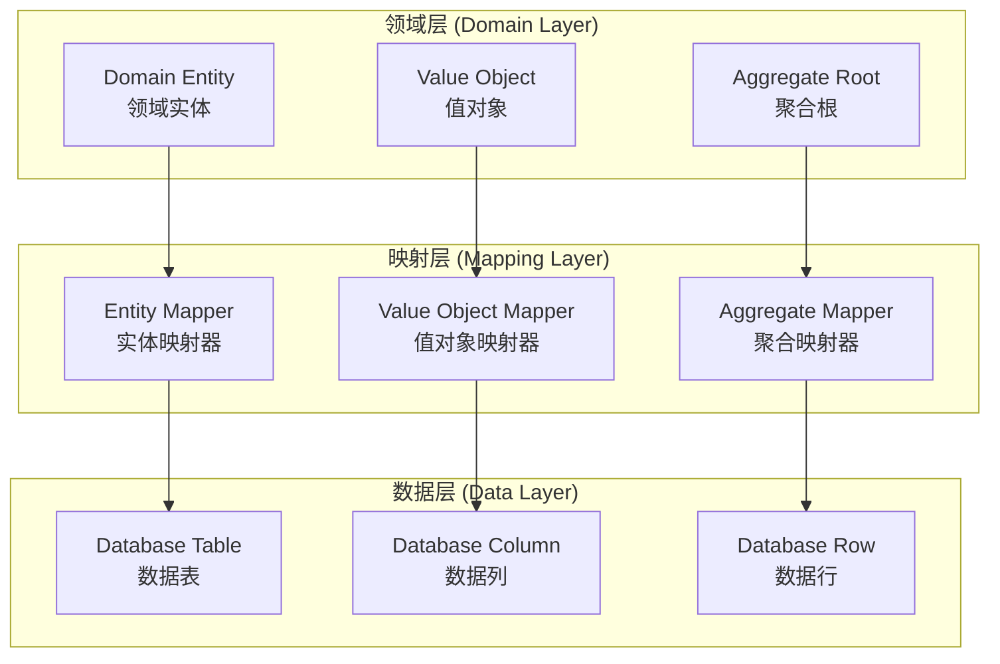

# 数据表与领域实体映射关系

> **版本**: 1.0.0 | **创建日期**: 2025-01-27 | **模块**: libs/domain-kernel

## 📋 概述

本文档阐述数据表与领域实体的映射关系，以 `User` 实体为例，说明如何在关系型数据库（PostgreSQL）和文档数据库（MongoDB）中存储领域实体，以及如何实现领域模型与数据模型的转换。

## 🗄️ 数据库支持

本项目基础设施层支持两种数据库：

1. **MikroORM + PostgreSQL**: 关系型数据库，支持 ACID 事务和复杂查询
2. **MikroORM + MongoDB**: 文档数据库，支持灵活的数据结构和水平扩展

## 🏗️ 映射关系架构

### 1.1 领域层与数据层分离



### 1.2 映射原则

1. **领域优先**: 领域模型驱动数据模型设计
2. **数据完整性**: 确保数据存储的完整性和一致性
3. **性能优化**: 考虑查询性能和数据存储效率
4. **多租户支持**: 支持租户隔离和数据共享
5. **事件溯源**: 支持事件存储和状态重建

## 📊 User 实体映射示例

### 2.1 User 领域实体结构

```typescript
// 领域实体定义
export class User extends BaseEntity<UserId> {
  private _email: Email;           // 值对象
  private _username: Username;      // 值对象
  private _status: UserStatus;      // 枚举
  private _activatedAt?: Date;     // 可选时间戳
  private _lastLoginAt?: Date;     // 可选时间戳
}
```

### 2.2 PostgreSQL 数据表设计

#### 2.2.1 主表结构 (users)

```sql
CREATE TABLE users (
    -- 基础字段
    id VARCHAR(36) PRIMARY KEY,
    tenant_id VARCHAR(36) NOT NULL,
    organization_id VARCHAR(36),
    department_id VARCHAR(36),
    user_id VARCHAR(36),
    
    -- 业务字段
    email VARCHAR(255) NOT NULL,
    username VARCHAR(100) NOT NULL,
    status VARCHAR(20) NOT NULL DEFAULT 'PENDING',
    activated_at TIMESTAMP NULL,
    last_login_at TIMESTAMP NULL,
    
    -- 审计字段
    created_at TIMESTAMP NOT NULL DEFAULT CURRENT_TIMESTAMP,
    updated_at TIMESTAMP NOT NULL DEFAULT CURRENT_TIMESTAMP ON UPDATE CURRENT_TIMESTAMP,
    deleted_at TIMESTAMP NULL,
    version INT NOT NULL DEFAULT 1,
    created_by VARCHAR(36) NOT NULL,
    updated_by VARCHAR(36) NOT NULL,
    deleted_by VARCHAR(36) NULL,
    
    -- 共享字段
    is_shared BOOLEAN NOT NULL DEFAULT FALSE,
    sharing_level VARCHAR(20) NULL,
    
    -- 索引
    INDEX idx_tenant_id (tenant_id),
    INDEX idx_email_tenant (email, tenant_id),
    INDEX idx_username_tenant (username, tenant_id),
    INDEX idx_status (status),
    INDEX idx_created_at (created_at),
    UNIQUE KEY uk_email_tenant (email, tenant_id),
    UNIQUE KEY uk_username_tenant (username, tenant_id)
);
```

#### 2.2.2 字段映射关系

| 领域实体字段 | 数据表字段 | 类型 | 约束 | 说明 |
|-------------|-----------|------|------|------|
| `id` | `id` | VARCHAR(36) | PRIMARY KEY | 实体唯一标识符 |
| `tenantId` | `tenant_id` | VARCHAR(36) | NOT NULL | 租户标识符 |
| `organizationId` | `organization_id` | VARCHAR(36) | NULL | 组织标识符 |
| `departmentId` | `department_id` | VARCHAR(36) | NULL | 部门标识符 |
| `userId` | `user_id` | VARCHAR(36) | NULL | 用户标识符 |
| `_email.value` | `email` | VARCHAR(255) | NOT NULL | 邮箱地址 |
| `_username.value` | `username` | VARCHAR(100) | NOT NULL | 用户名 |
| `_status` | `status` | VARCHAR(20) | NOT NULL | 用户状态 |
| `_activatedAt` | `activated_at` | TIMESTAMP | NULL | 激活时间 |
| `_lastLoginAt` | `last_login_at` | TIMESTAMP | NULL | 最后登录时间 |
| `auditInfo.createdAt` | `created_at` | TIMESTAMP | NOT NULL | 创建时间 |
| `auditInfo.updatedAt` | `updated_at` | TIMESTAMP | NOT NULL | 更新时间 |
| `auditInfo.deletedAt` | `deleted_at` | TIMESTAMP | NULL | 删除时间 |
| `auditInfo.version` | `version` | INT | NOT NULL | 版本号 |
| `auditInfo.createdBy` | `created_by` | VARCHAR(36) | NOT NULL | 创建者 |
| `auditInfo.updatedBy` | `updated_by` | VARCHAR(36) | NOT NULL | 更新者 |
| `auditInfo.deletedBy` | `deleted_by` | VARCHAR(36) | NULL | 删除者 |
| `isShared` | `is_shared` | BOOLEAN | NOT NULL | 是否共享 |
| `sharingLevel` | `sharing_level` | VARCHAR(20) | NULL | 共享级别 |

### 2.3 MongoDB 文档设计

#### 2.3.1 文档结构 (users)

```javascript
// MongoDB 文档结构
{
  _id: ObjectId("..."),
  
  // 基础字段
  id: "user-123",
  tenantId: "tenant-456",
  organizationId: "org-789",
  departmentId: "dept-101",
  userId: "user-123",
  
  // 业务字段
  email: "test@example.com",
  username: "testuser",
  status: "ACTIVE",
  activatedAt: ISODate("2025-01-27T10:00:00Z"),
  lastLoginAt: ISODate("2025-01-27T09:30:00Z"),
  
  // 审计字段
  createdAt: ISODate("2025-01-27T08:00:00Z"),
  updatedAt: ISODate("2025-01-27T10:00:00Z"),
  deletedAt: null,
  version: 1,
  createdBy: "system",
  updatedBy: "system",
  deletedBy: null,
  
  // 共享字段
  isShared: false,
  sharingLevel: null,
  
  // MongoDB 特有字段
  _tenant: "tenant-456",  // 租户分片键
  _version: 1,            // 乐观锁版本
}
```

#### 2.3.2 索引设计

```javascript
// MongoDB 索引定义
db.users.createIndex({ "tenantId": 1, "email": 1 }, { unique: true });
db.users.createIndex({ "tenantId": 1, "username": 1 }, { unique: true });
db.users.createIndex({ "tenantId": 1, "status": 1 });
db.users.createIndex({ "tenantId": 1, "createdAt": -1 });
db.users.createIndex({ "tenantId": 1, "organizationId": 1 });
db.users.createIndex({ "tenantId": 1, "departmentId": 1 });
db.users.createIndex({ "isShared": 1, "sharingLevel": 1 });
```

### 2.4 值对象映射

#### 2.3.1 Email 值对象映射

```typescript
// 领域层：Email 值对象
export class Email extends BaseValueObject {
  private constructor(private readonly value: string) {
    super();
    this.validate();
  }
  
  public getValue(): string {
    return this.value;
  }
}
```

```sql
-- 数据层：Email 存储
-- 直接存储为字符串，在应用层进行值对象转换
email VARCHAR(255) NOT NULL
```

#### 2.3.2 Username 值对象映射

```typescript
// 领域层：Username 值对象
export class Username extends BaseValueObject {
  private constructor(private readonly value: string) {
    super();
    this.validate();
  }
  
  public getValue(): string {
    return this.value;
  }
}
```

```sql
-- 数据层：Username 存储
-- 直接存储为字符串，在应用层进行值对象转换
username VARCHAR(100) NOT NULL
```

### 2.4 枚举映射

#### 2.4.1 UserStatus 枚举映射

```typescript
// 领域层：用户状态枚举
export enum UserStatus {
  PENDING = 'PENDING',
  ACTIVE = 'ACTIVE',
  DISABLED = 'DISABLED',
  DELETED = 'DELETED'
}
```

```sql
-- 数据层：状态存储
-- 使用字符串存储枚举值
status VARCHAR(20) NOT NULL DEFAULT 'PENDING'

-- 约束检查
CONSTRAINT chk_status CHECK (status IN ('PENDING', 'ACTIVE', 'DISABLED', 'DELETED'))
```

## 🔄 MikroORM 实体映射

### 3.1 PostgreSQL 实体映射

```typescript
/**
 * PostgreSQL User 实体
 * @description MikroORM 实体，映射到 PostgreSQL 数据库
 */
import { Entity, PrimaryKey, Property, Index, Unique } from '@mikro-orm/core';

@Entity({ tableName: 'users' })
@Index({ properties: ['tenantId'] })
@Index({ properties: ['tenantId', 'email'] })
@Index({ properties: ['tenantId', 'username'] })
@Index({ properties: ['status'] })
@Index({ properties: ['createdAt'] })
@Unique({ properties: ['email', 'tenantId'] })
@Unique({ properties: ['username', 'tenantId'] })
export class UserEntity {
  @PrimaryKey()
  id!: string;

  @Property()
  tenantId!: string;

  @Property({ nullable: true })
  organizationId?: string;

  @Property({ nullable: true })
  departmentId?: string;

  @Property({ nullable: true })
  userId?: string;

  @Property()
  email!: string;

  @Property()
  username!: string;

  @Property()
  status!: string;

  @Property({ nullable: true })
  activatedAt?: Date;

  @Property({ nullable: true })
  lastLoginAt?: Date;

  @Property()
  createdAt!: Date;

  @Property()
  updatedAt!: Date;

  @Property({ nullable: true })
  deletedAt?: Date;

  @Property()
  version!: number;

  @Property()
  createdBy!: string;

  @Property()
  updatedBy!: string;

  @Property({ nullable: true })
  deletedBy?: string;

  @Property()
  isShared!: boolean;

  @Property({ nullable: true })
  sharingLevel?: string;
}
```

### 3.2 MongoDB 实体映射

```typescript
/**
 * MongoDB User 实体
 * @description MikroORM 实体，映射到 MongoDB 数据库
 */
import { Entity, PrimaryKey, Property, Index, Unique } from '@mikro-orm/mongodb';

@Entity({ collection: 'users' })
@Index({ properties: ['tenantId'] })
@Index({ properties: ['tenantId', 'email'] })
@Index({ properties: ['tenantId', 'username'] })
@Index({ properties: ['status'] })
@Index({ properties: ['createdAt'] })
@Unique({ properties: ['email', 'tenantId'] })
@Unique({ properties: ['username', 'tenantId'] })
export class UserDocument {
  @PrimaryKey()
  _id!: ObjectId;

  @Property()
  id!: string;

  @Property()
  tenantId!: string;

  @Property({ nullable: true })
  organizationId?: string;

  @Property({ nullable: true })
  departmentId?: string;

  @Property({ nullable: true })
  userId?: string;

  @Property()
  email!: string;

  @Property()
  username!: string;

  @Property()
  status!: string;

  @Property({ nullable: true })
  activatedAt?: Date;

  @Property({ nullable: true })
  lastLoginAt?: Date;

  @Property()
  createdAt!: Date;

  @Property()
  updatedAt!: Date;

  @Property({ nullable: true })
  deletedAt?: Date;

  @Property()
  version!: number;

  @Property()
  createdBy!: string;

  @Property()
  updatedBy!: string;

  @Property({ nullable: true })
  deletedBy?: string;

  @Property()
  isShared!: boolean;

  @Property({ nullable: true })
  sharingLevel?: string;

  // MongoDB 特有字段
  @Property()
  _tenant!: string;  // 租户分片键

  @Property()
  _version!: number; // 乐观锁版本
}
```

## 🔄 映射器实现

### 4.1 实体映射器

```typescript
/**
 * User 实体映射器
 * @description 负责领域实体与数据库实体之间的转换
 */
export class UserMapper {
  /**
   * 将领域实体转换为 PostgreSQL 实体
   * @param user - 用户领域实体
   * @returns PostgreSQL 实体
   */
  public static toPostgreSQLEntity(user: User): UserEntity {
    const entity = new UserEntity();
    entity.id = user.id.getValue();
    entity.tenantId = user.tenantId.getValue();
    entity.organizationId = user.organizationId?.getValue();
    entity.departmentId = user.departmentId?.getValue();
    entity.userId = user.userId?.getValue();
    entity.email = user.getEmail().getValue();
    entity.username = user.getUsername().getValue();
    entity.status = user.getStatus();
    entity.activatedAt = user.getActivatedAt();
    entity.lastLoginAt = user.getLastLoginAt();
    entity.createdAt = user.createdAt;
    entity.updatedAt = user.updatedAt;
    entity.deletedAt = user.deletedAt;
    entity.version = user.version;
    entity.createdBy = user.createdBy;
    entity.updatedBy = user.updatedBy;
    entity.deletedBy = user.deletedBy;
    entity.isShared = user.isShared;
    entity.sharingLevel = user.sharingLevel;
    return entity;
  }

  /**
   * 将领域实体转换为 MongoDB 文档
   * @param user - 用户领域实体
   * @returns MongoDB 文档
   */
  public static toMongoDBDocument(user: User): UserDocument {
    const document = new UserDocument();
    document.id = user.id.getValue();
    document.tenantId = user.tenantId.getValue();
    document.organizationId = user.organizationId?.getValue();
    document.departmentId = user.departmentId?.getValue();
    document.userId = user.userId?.getValue();
    document.email = user.getEmail().getValue();
    document.username = user.getUsername().getValue();
    document.status = user.getStatus();
    document.activatedAt = user.getActivatedAt();
    document.lastLoginAt = user.getLastLoginAt();
    document.createdAt = user.createdAt;
    document.updatedAt = user.updatedAt;
    document.deletedAt = user.deletedAt;
    document.version = user.version;
    document.createdBy = user.createdBy;
    document.updatedBy = user.updatedBy;
    document.deletedBy = user.deletedBy;
    document.isShared = user.isShared;
    document.sharingLevel = user.sharingLevel;
    document._tenant = user.tenantId.getValue();
    document._version = user.version;
    return document;
  }

  /**
   * 将 PostgreSQL 实体转换为领域实体
   * @param entity - PostgreSQL 实体
   * @returns 用户领域实体
   */
  public static fromPostgreSQLEntity(entity: UserEntity): User {
    return User.fromExisting(
      UserId.create(entity.id),
      TenantId.create(entity.tenantId),
      Email.create(entity.email),
      Username.create(entity.username),
      entity.status as UserStatus,
      entity.createdAt,
      entity.updatedAt,
      entity.version,
    );
  }

  /**
   * 将 MongoDB 文档转换为领域实体
   * @param document - MongoDB 文档
   * @returns 用户领域实体
   */
  public static fromMongoDBDocument(document: UserDocument): User {
    return User.fromExisting(
      UserId.create(document.id),
      TenantId.create(document.tenantId),
      Email.create(document.email),
      Username.create(document.username),
      document.status as UserStatus,
      document.createdAt,
      document.updatedAt,
      document.version,
    );
  }

  /**
   * 将领域实体转换为数据行（兼容旧版本）
   * @param user - 用户领域实体
   * @returns 数据行对象
   */
  public static toDataRow(user: User): UserDataRow {
    return {
      id: user.id.getValue(),
      tenant_id: user.tenantId.getValue(),
      organization_id: user.organizationId?.getValue(),
      department_id: user.departmentId?.getValue(),
      user_id: user.userId?.getValue(),
      email: user.getEmail().getValue(),
      username: user.getUsername().getValue(),
      status: user.getStatus(),
      activated_at: user.getActivatedAt(),
      last_login_at: user.getLastLoginAt(),
      created_at: user.createdAt,
      updated_at: user.updatedAt,
      deleted_at: user.deletedAt,
      version: user.version,
      created_by: user.createdBy,
      updated_by: user.updatedBy,
      deleted_by: user.deletedBy,
      is_shared: user.isShared,
      sharing_level: user.sharingLevel,
    };
  }

  /**
   * 将数据行转换为领域实体
   * @param dataRow - 数据行对象
   * @returns 用户领域实体
   */
  public static toDomainEntity(dataRow: UserDataRow): User {
    return User.fromExisting(
      UserId.create(dataRow.id),
      TenantId.create(dataRow.tenant_id),
      Email.create(dataRow.email),
      Username.create(dataRow.username),
      dataRow.status as UserStatus,
      dataRow.created_at,
      dataRow.updated_at,
      dataRow.version,
    );
  }

  /**
   * 批量转换数据行为领域实体
   * @param dataRows - 数据行数组
   * @returns 用户领域实体数组
   */
  public static toDomainEntities(dataRows: UserDataRow[]): User[] {
    return dataRows.map(row => this.toDomainEntity(row));
  }
}
```

### 3.2 数据行接口定义

```typescript
/**
 * 用户数据行接口
 * @description 定义数据库表结构对应的 TypeScript 接口
 */
export interface UserDataRow {
  // 基础字段
  id: string;
  tenant_id: string;
  organization_id?: string;
  department_id?: string;
  user_id?: string;
  
  // 业务字段
  email: string;
  username: string;
  status: string;
  activated_at?: Date;
  last_login_at?: Date;
  
  // 审计字段
  created_at: Date;
  updated_at: Date;
  deleted_at?: Date;
  version: number;
  created_by: string;
  updated_by: string;
  deleted_by?: string;
  
  // 共享字段
  is_shared: boolean;
  sharing_level?: string;
}
```

### 3.3 查询条件映射

```typescript
/**
 * 查询条件映射器
 * @description 将领域查询条件转换为数据库查询条件
 */
export class UserQueryMapper {
  /**
   * 将领域查询转换为 SQL 查询
   * @param query - 领域查询对象
   * @returns SQL 查询条件
   */
  public static toSqlQuery(query: UserQuery): SqlQuery {
    const conditions: string[] = [];
    const parameters: any[] = [];
    
    // 租户隔离
    if (query.tenantId) {
      conditions.push('tenant_id = ?');
      parameters.push(query.tenantId.getValue());
    }
    
    // 邮箱查询
    if (query.email) {
      conditions.push('email = ?');
      parameters.push(query.email.getValue());
    }
    
    // 用户名查询
    if (query.username) {
      conditions.push('username = ?');
      parameters.push(query.username.getValue());
    }
    
    // 状态查询
    if (query.status) {
      conditions.push('status = ?');
      parameters.push(query.status);
    }
    
    // 软删除过滤
    if (!query.includeDeleted) {
      conditions.push('deleted_at IS NULL');
    }
    
    return {
      where: conditions.length > 0 ? conditions.join(' AND ') : '1=1',
      parameters,
    };
  }
}
```

## 🗄️ MikroORM 数据库操作示例

### 4.1 PostgreSQL 操作示例

```typescript
/**
 * PostgreSQL 用户仓储实现
 */
import { Injectable } from '@nestjs/common';
import { InjectRepository } from '@mikro-orm/nestjs';
import { EntityRepository } from '@mikro-orm/postgresql';
import { UserEntity } from './user.entity';
import { User } from '@hl8/domain-kernel';
import { UserMapper } from './user.mapper';

@Injectable()
export class PostgreSQLUserRepository {
  constructor(
    @InjectRepository(UserEntity)
    private readonly userRepository: EntityRepository<UserEntity>,
  ) {}

  /**
   * 创建用户
   */
  async create(user: User): Promise<void> {
    const entity = UserMapper.toPostgreSQLEntity(user);
    await this.userRepository.persistAndFlush(entity);
  }

  /**
   * 根据邮箱和租户查询用户
   */
  async findByEmailAndTenant(
    email: string,
    tenantId: string,
  ): Promise<User | null> {
    const entity = await this.userRepository.findOne({
      email,
      tenantId,
      deletedAt: null,
    });

    return entity ? UserMapper.fromPostgreSQLEntity(entity) : null;
  }

  /**
   * 更新用户
   */
  async update(user: User): Promise<void> {
    const entity = await this.userRepository.findOneOrFail(user.id.getValue());
    const updatedEntity = UserMapper.toPostgreSQLEntity(user);
    Object.assign(entity, updatedEntity);
    await this.userRepository.flush();
  }

  /**
   * 软删除用户
   */
  async delete(userId: string): Promise<void> {
    const entity = await this.userRepository.findOneOrFail(userId);
    entity.deletedAt = new Date();
    await this.userRepository.flush();
  }
}
```

### 4.2 MongoDB 操作示例

```typescript
/**
 * MongoDB 用户仓储实现
 */
import { Injectable } from '@nestjs/common';
import { InjectRepository } from '@mikro-orm/nestjs';
import { EntityRepository } from '@mikro-orm/mongodb';
import { UserDocument } from './user.document';
import { User } from '@hl8/domain-kernel';
import { UserMapper } from './user.mapper';

@Injectable()
export class MongoDBUserRepository {
  constructor(
    @InjectRepository(UserDocument)
    private readonly userRepository: EntityRepository<UserDocument>,
  ) {}

  /**
   * 创建用户
   */
  async create(user: User): Promise<void> {
    const document = UserMapper.toMongoDBDocument(user);
    await this.userRepository.persistAndFlush(document);
  }

  /**
   * 根据邮箱和租户查询用户
   */
  async findByEmailAndTenant(
    email: string,
    tenantId: string,
  ): Promise<User | null> {
    const document = await this.userRepository.findOne({
      email,
      tenantId,
      deletedAt: null,
    });

    return document ? UserMapper.fromMongoDBDocument(document) : null;
  }

  /**
   * 更新用户
   */
  async update(user: User): Promise<void> {
    const document = await this.userRepository.findOneOrFail(user.id.getValue());
    const updatedDocument = UserMapper.toMongoDBDocument(user);
    Object.assign(document, updatedDocument);
    await this.userRepository.flush();
  }

  /**
   * 软删除用户
   */
  async delete(userId: string): Promise<void> {
    const document = await this.userRepository.findOneOrFail(userId);
    document.deletedAt = new Date();
    await this.userRepository.flush();
  }

  /**
   * 聚合查询示例
   */
  async findUsersByTenantWithStats(tenantId: string): Promise<{
    users: User[];
    totalCount: number;
    activeCount: number;
  }> {
    const pipeline = [
      { $match: { tenantId, deletedAt: null } },
      {
        $group: {
          _id: null,
          totalCount: { $sum: 1 },
          activeCount: {
            $sum: { $cond: [{ $eq: ['$status', 'ACTIVE'] }, 1, 0] },
          },
          users: { $push: '$$ROOT' },
        },
      },
    ];

    const result = await this.userRepository.aggregate(pipeline);
    const data = result[0];

    return {
      users: data.users.map((doc: any) => UserMapper.fromMongoDBDocument(doc)),
      totalCount: data.totalCount,
      activeCount: data.activeCount,
    };
  }
}
```

### 4.3 统一仓储接口

```typescript
/**
 * 用户仓储接口
 */
export interface IUserRepository {
  create(user: User): Promise<void>;
  findById(id: string): Promise<User | null>;
  findByEmailAndTenant(email: string, tenantId: string): Promise<User | null>;
  update(user: User): Promise<void>;
  delete(id: string): Promise<void>;
  findUsersByTenant(tenantId: string, page: number, size: number): Promise<{
    users: User[];
    total: number;
  }>;
}

/**
 * 仓储工厂
 */
@Injectable()
export class UserRepositoryFactory {
  constructor(
    private readonly postgresqlRepo: PostgreSQLUserRepository,
    private readonly mongodbRepo: MongoDBUserRepository,
  ) {}

  create(databaseType: 'postgresql' | 'mongodb'): IUserRepository {
    switch (databaseType) {
      case 'postgresql':
        return this.postgresqlRepo;
      case 'mongodb':
        return this.mongodbRepo;
      default:
        throw new Error(`Unsupported database type: ${databaseType}`);
    }
  }
}
```

## 🗄️ 数据库操作示例

### 5.1 创建用户

```typescript
/**
 * 创建用户示例
 */
export class CreateUserExample {
  constructor(private readonly userRepository: IUserRepository) {}

  async createUser(
    tenantId: TenantId,
    email: Email,
    username: Username,
  ): Promise<User> {
    // 1. 创建领域实体
    const user = User.create(tenantId, email, username);
    
    // 2. 转换为数据行
    const dataRow = UserMapper.toDataRow(user);
    
    // 3. 保存到数据库
    await this.userRepository.save(dataRow);
    
    return user;
  }
}
```

### 4.2 查询用户

```typescript
/**
 * 查询用户示例
 */
export class QueryUserExample {
  constructor(private readonly userRepository: IUserRepository) {}

  async findByEmailAndTenant(
    email: Email,
    tenantId: TenantId,
  ): Promise<User | null> {
    // 1. 构建查询条件
    const query = UserQueryMapper.toSqlQuery({
      email,
      tenantId,
      includeDeleted: false,
    });
    
    // 2. 执行数据库查询
    const dataRow = await this.userRepository.findOne(query);
    
    // 3. 转换为领域实体
    return dataRow ? UserMapper.toDomainEntity(dataRow) : null;
  }
}
```

### 4.3 更新用户

```typescript
/**
 * 更新用户示例
 */
export class UpdateUserExample {
  constructor(private readonly userRepository: IUserRepository) {}

  async activateUser(userId: UserId): Promise<void> {
    // 1. 查询现有用户
    const dataRow = await this.userRepository.findById(userId.getValue());
    if (!dataRow) {
      throw new UserNotFoundException('用户不存在');
    }
    
    // 2. 转换为领域实体
    const user = UserMapper.toDomainEntity(dataRow);
    
    // 3. 执行业务逻辑
    user.activate();
    
    // 4. 转换回数据行
    const updatedDataRow = UserMapper.toDataRow(user);
    
    // 5. 更新数据库
    await this.userRepository.update(updatedDataRow);
  }
}
```

## 🔒 多租户数据隔离

### 5.1 租户隔离策略

```sql
-- 租户级数据隔离
-- 所有查询都自动添加租户过滤条件
SELECT * FROM users 
WHERE tenant_id = ? 
  AND deleted_at IS NULL;

-- 组织级数据隔离
SELECT * FROM users 
WHERE tenant_id = ? 
  AND organization_id = ?
  AND deleted_at IS NULL;

-- 部门级数据隔离
SELECT * FROM users 
WHERE tenant_id = ? 
  AND organization_id = ?
  AND department_id = ?
  AND deleted_at IS NULL;
```

### 5.2 数据共享支持

```sql
-- 共享数据查询
SELECT * FROM users 
WHERE tenant_id = ? 
  AND (is_shared = TRUE OR user_id = ?)
  AND deleted_at IS NULL;

-- 跨租户共享数据查询
SELECT * FROM users 
WHERE is_shared = TRUE 
  AND sharing_level IN ('PLATFORM', 'TENANT')
  AND deleted_at IS NULL;
```

## ⚙️ MikroORM 配置

### 6.1 PostgreSQL 配置

```typescript
// mikro-orm.config.ts
import { defineConfig } from '@mikro-orm/core';
import { PostgreSqlDriver } from '@mikro-orm/postgresql';
import { UserEntity } from './entities/user.entity';

export default defineConfig({
  driver: PostgreSqlDriver,
  host: process.env.DB_HOST || 'localhost',
  port: parseInt(process.env.DB_PORT || '5432'),
  user: process.env.DB_USER || 'postgres',
  password: process.env.DB_PASSWORD || 'password',
  dbName: process.env.DB_NAME || 'hl8_saas',
  
  entities: [UserEntity],
  entitiesTs: ['./src/entities'],
  
  migrations: {
    path: './migrations',
    pattern: /^[\w-]+\d+\.(ts|js)$/,
  },
  
  seeder: {
    path: './seeders',
    defaultSeeder: 'DatabaseSeeder',
  },
  
  debug: process.env.NODE_ENV === 'development',
  
  // 连接池配置
  pool: {
    min: 2,
    max: 10,
  },
  
  // 缓存配置
  cache: {
    enabled: true,
    pretty: true,
    adapter: 'redis',
    options: {
      host: process.env.REDIS_HOST || 'localhost',
      port: parseInt(process.env.REDIS_PORT || '6379'),
    },
  },
});
```

### 6.2 MongoDB 配置

```typescript
// mikro-orm.mongodb.config.ts
import { defineConfig } from '@mikro-orm/core';
import { MongoDriver } from '@mikro-orm/mongodb';
import { UserDocument } from './documents/user.document';

export default defineConfig({
  driver: MongoDriver,
  clientUrl: process.env.MONGODB_URL || 'mongodb://localhost:27017',
  dbName: process.env.MONGODB_DB_NAME || 'hl8_saas',
  
  entities: [UserDocument],
  entitiesTs: ['./src/documents'],
  
  debug: process.env.NODE_ENV === 'development',
  
  // MongoDB 特有配置
  ensureIndexes: true,
  forceUtc: true,
  
  // 连接配置
  connect: true,
  autoLoadEntities: true,
  
  // 缓存配置
  cache: {
    enabled: true,
    adapter: 'redis',
    options: {
      host: process.env.REDIS_HOST || 'localhost',
      port: parseInt(process.env.REDIS_PORT || '6379'),
    },
  },
});
```

### 6.3 NestJS 模块配置

```typescript
// app.module.ts
import { Module } from '@nestjs/common';
import { MikroOrmModule } from '@mikro-orm/nestjs';
import { UserEntity } from './entities/user.entity';
import { UserDocument } from './documents/user.document';

@Module({
  imports: [
    // PostgreSQL 配置
    MikroOrmModule.forRoot({
      driver: PostgreSqlDriver,
      // ... PostgreSQL 配置
      entities: [UserEntity],
    }),
    
    // MongoDB 配置
    MikroOrmModule.forRoot({
      driver: MongoDriver,
      // ... MongoDB 配置
      entities: [UserDocument],
    }),
    
    // 实体注册
    MikroOrmModule.forFeature([UserEntity], 'postgresql'),
    MikroOrmModule.forFeature([UserDocument], 'mongodb'),
  ],
})
export class AppModule {}
```

## 📈 性能优化

### 7.1 索引策略

```sql
-- 主键索引
PRIMARY KEY (id)

-- 租户隔离索引
INDEX idx_tenant_id (tenant_id)

-- 业务查询索引
INDEX idx_email_tenant (email, tenant_id)
INDEX idx_username_tenant (username, tenant_id)
INDEX idx_status (status)

-- 时间范围查询索引
INDEX idx_created_at (created_at)
INDEX idx_updated_at (updated_at)

-- 软删除索引
INDEX idx_deleted_at (deleted_at)
```

### 6.2 查询优化

```typescript
/**
 * 查询优化示例
 */
export class OptimizedUserQuery {
  /**
   * 分页查询用户
   */
  async findUsersWithPagination(
    tenantId: TenantId,
    page: number,
    size: number,
  ): Promise<{ users: User[]; total: number }> {
    // 使用 LIMIT 和 OFFSET 进行分页
    const offset = (page - 1) * size;
    
    const query = `
      SELECT * FROM users 
      WHERE tenant_id = ? AND deleted_at IS NULL
      ORDER BY created_at DESC
      LIMIT ? OFFSET ?
    `;
    
    const [users, total] = await Promise.all([
      this.userRepository.findMany(query, [tenantId.getValue(), size, offset]),
      this.userRepository.count(`WHERE tenant_id = ? AND deleted_at IS NULL`, [tenantId.getValue()]),
    ]);
    
    return {
      users: UserMapper.toDomainEntities(users),
      total,
    };
  }
}
```

## 🧪 测试策略

### 7.1 单元测试

```typescript
/**
 * 用户映射器测试
 */
describe('UserMapper', () => {
  it('should convert domain entity to data row', () => {
    // 准备测试数据
    const user = User.create(
      TenantId.create('tenant-123'),
      Email.create('test@example.com'),
      Username.create('testuser'),
    );
    
    // 执行转换
    const dataRow = UserMapper.toDataRow(user);
    
    // 验证结果
    expect(dataRow.id).toBe(user.id.getValue());
    expect(dataRow.email).toBe('test@example.com');
    expect(dataRow.username).toBe('testuser');
    expect(dataRow.status).toBe('PENDING');
  });
  
  it('should convert data row to domain entity', () => {
    // 准备测试数据
    const dataRow: UserDataRow = {
      id: 'user-123',
      tenant_id: 'tenant-123',
      email: 'test@example.com',
      username: 'testuser',
      status: 'ACTIVE',
      created_at: new Date(),
      updated_at: new Date(),
      version: 1,
      created_by: 'system',
      updated_by: 'system',
      is_shared: false,
    };
    
    // 执行转换
    const user = UserMapper.toDomainEntity(dataRow);
    
    // 验证结果
    expect(user.id.getValue()).toBe('user-123');
    expect(user.getEmail().getValue()).toBe('test@example.com');
    expect(user.getStatus()).toBe('ACTIVE');
  });
});
```

### 7.2 集成测试

```typescript
/**
 * 用户数据库操作集成测试
 */
describe('UserRepository Integration', () => {
  it('should save and retrieve user', async () => {
    // 创建用户
    const user = User.create(
      TenantId.create('tenant-123'),
      Email.create('test@example.com'),
      Username.create('testuser'),
    );
    
    // 保存到数据库
    await userRepository.save(UserMapper.toDataRow(user));
    
    // 从数据库查询
    const retrievedUser = await userRepository.findByEmailAndTenant(
      Email.create('test@example.com'),
      TenantId.create('tenant-123'),
    );
    
    // 验证结果
    expect(retrievedUser).toBeDefined();
    expect(retrievedUser!.getEmail().getValue()).toBe('test@example.com');
  });
});
```

## 📋 最佳实践

### 8.1 映射器设计原则

1. **单一职责**: 每个映射器只负责一种实体类型的转换
2. **无状态**: 映射器应该是无状态的，可以安全地并发使用
3. **类型安全**: 使用 TypeScript 类型系统确保类型安全
4. **性能优化**: 避免不必要的对象创建和转换
5. **错误处理**: 提供清晰的错误信息和异常处理

### 8.2 数据一致性保证

1. **事务管理**: 使用数据库事务确保数据一致性
2. **乐观锁**: 使用版本号实现乐观锁机制
3. **软删除**: 使用软删除保持数据完整性
4. **审计追踪**: 记录所有数据变更的审计信息

### 8.3 性能考虑

1. **索引优化**: 根据查询模式设计合适的索引
2. **查询优化**: 避免 N+1 查询问题
3. **分页处理**: 使用分页避免大量数据查询
4. **缓存策略**: 对频繁查询的数据进行缓存

## 🎯 总结

数据表与领域实体的映射关系是 DDD 架构中的重要组成部分。通过合理的映射设计，可以实现：

1. **领域模型与数据模型的分离**: 保持领域层的纯净性
2. **多数据库支持**: 同时支持 PostgreSQL 和 MongoDB 两种数据库
3. **MikroORM 集成**: 利用 MikroORM 的强大功能简化数据访问
4. **多租户支持**: 实现数据隔离和共享
5. **性能优化**: 通过索引和查询优化提升性能
6. **数据一致性**: 通过事务和锁机制保证数据一致性
7. **可测试性**: 通过映射器实现领域层与数据层的解耦

### 🚀 技术优势

- **统一 ORM**: 使用 MikroORM 统一管理两种数据库
- **类型安全**: 完整的 TypeScript 类型支持
- **灵活配置**: 支持不同数据库的特定配置
- **性能优化**: 针对不同数据库的优化策略
- **扩展性**: 易于添加新的数据库支持

通过遵循本文档的设计原则和最佳实践，可以构建出高质量、可维护、支持多数据库的数据访问层。

---

**相关文档**:

- [领域层开发指南](./06-DOMAIN_LAYER_DEVELOPMENT_GUIDE.md)
- [架构模式详细设计](../packages/hybrid-archi/docs/02-ARCHITECTURE_PATTERNS_DETAIL.md)
- [应用指南](../packages/hybrid-archi/docs/03-APPLICATION_GUIDE.md)
