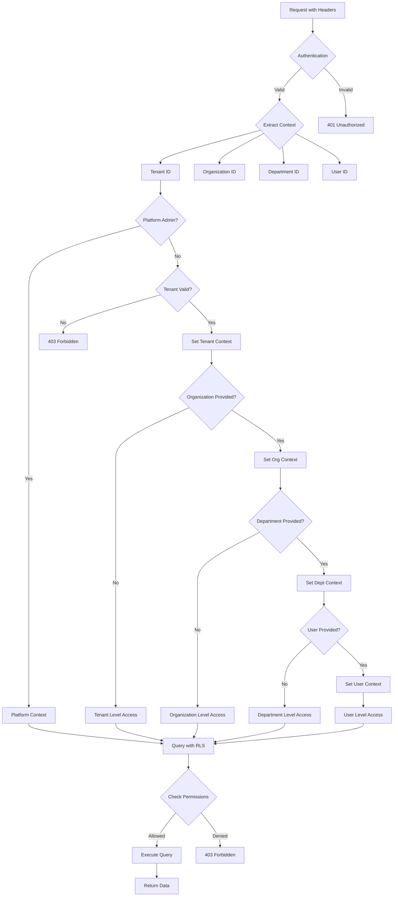

# Isolation Boundary Diagrams

> **Purpose**: Visual representation of the 5-tier isolation architecture  
> **Scope**: Platform, Tenant, Organization, Department, User levels

---

## 5-Tier Isolation Architecture

```
┌─────────────────────────────────────────────────────────────────┐
│                         PLATFORM LEVEL                          │
│  (Platform Admins Only - Separate Schema/Database)              │
├─────────────────────────────────────────────────────────────────┤
│  • Platform Configuration                                        │
│  • Platform Settings                                             │
│  • Tenant Registry                                               │
│  • Platform Audit Logs                                           │
└─────────────────────────────────────────────────────────────────┘
                               │
                    ┌──────────┴──────────┐
                    │  TENANT REGISTRY    │
                    └─────────────────────┘
                               │
              ┌────────────────┴────────────────┐
              │                                  │
┌─────────────▼──────────────┐    ┌─────────────▼──────────────┐
│      TENANT 1              │    │      TENANT 2              │
│  (ROW_LEVEL_SECURITY)      │    │  (ROW_LEVEL_SECURITY)      │
├────────────────────────────┤    ├────────────────────────────┤
│  • Tenant Settings         │    │  • Tenant Settings         │
│  • Tenant Users            │    │  • Tenant Users            │
│  • Organizations           │    │  • Organizations           │
│  • Departments             │    │  • Departments             │
│  • Tenant Data             │    │  • Tenant Data             │
└────────────────────────────┘    └────────────────────────────┘
        │                                 │
        │           (Isolated)            │
        │                                 │
┌───────▼────────┐              ┌────────▼────────┐
│ ORGANIZATION 1 │              │ ORGANIZATION 2  │
│  (Private)     │              │  (Shared)       │
├────────────────┤              ├─────────────────┤
│ • Org Settings │              │ • Org Settings  │
│ • Departments  │              │ • Departments   │
│ • Org Users    │              │ • Org Users     │
└────────────────┘              └─────────────────┘
        │                                 │
        │         │                       │
┌───────▼────▼──────────┐    ┌────────────▼──────────┐
│  DEPARTMENT 1         │    │  DEPARTMENT 2         │
│  (Level 1 - Root)     │    │  (Level 2)            │
├───────────────────────┤    ├───────────────────────┤
│ • Dept Settings       │    │ • Dept Settings       │
│ • Dept Users          │    │ • Dept Users          │
│   └─ Level 3 Dept     │    └─ Sub-departments      │
│       └─ Level 4 Dept │                          │
│           └─ ...      │                          │
└───────────────────────┘                          │
                                                   │
                                         ┌─────────▼──────────┐
                                         │   USER LEVEL       │
                                         │  (User-Private)    │
                                         ├────────────────────┤
                                         │ • User Profile     │
                                         │ • User Preferences │
                                         │ • Personal Data    │
                                         └────────────────────┘
```

---

## Data Flow and Access Patterns

### Vertical Access (Hierarchical)

```
Platform Admin
    │
    └─► Can access all tenant data
            │
            └─► Tenant Admin
                    │
                    └─► Can access all org data
                            │
                            └─► Org Admin
                                    │
                                    └─► Can access all dept data
                                            │
                                            └─► Dept Admin
                                                    │
                                                    └─► Can access all users in dept
                                                            │
                                                            └─► User
                                                                    │
                                                                    └─► Can access only own data
```

### Horizontal Access (Same Level)

```
Tenant A ──┐
           │
           └─► Complete isolation
           │
Tenant B ──┘

Organization A ──┐
                │
                └─► Isolated (unless shared)
                │
Organization B ──┘

Department A ──┐
              │
              └─► Hierarchical relationships
              │
Department B ──┘

User A ──┐
        │
        └─► Private by default
        │
User B ──┘
```

---

## RLS Policy Application

```sql
-- Platform Level (No RLS needed - separate schema)
CREATE SCHEMA platform;
-- No tenant_id required

-- Tenant Level (RLS applied)
CREATE TABLE tenants (
  id UUID PRIMARY KEY,
  code VARCHAR(50) NOT NULL,
  name VARCHAR(255) NOT NULL,
  -- No tenant_id (tenant table itself)
);

ALTER TABLE tenants ENABLE ROW LEVEL SECURITY;
-- No RLS policy needed (tenant table is global)

-- Tenant Data (RLS applied)
CREATE TABLE organizations (
  id UUID PRIMARY KEY,
  tenant_id UUID NOT NULL,  -- Required
  name VARCHAR(255) NOT NULL,
  organization_id UUID,     -- Optional
  department_id UUID,       -- Optional
  user_id UUID,             -- Optional
);

ALTER TABLE organizations ENABLE ROW LEVEL SECURITY;

CREATE POLICY org_tenant_isolation ON organizations
  FOR ALL
  USING (tenant_id = current_setting('app.current_tenant_id')::uuid);
```

---

## Access Control Flow



---

## Multi-Database Strategy

### Single Database with RLS (Default)

```
┌─────────────────────────────────────────────────┐
│         PostgreSQL Database                      │
├─────────────────────────────────────────────────┤
│  Schema: platform                                │
│    ├─ platform.settings                         │
│    ├─ platform.admins                           │
│    └─ platform.audit_logs                       │
├─────────────────────────────────────────────────┤
│  Schema: public (Tenant Data)                    │
│    ├─ tenants                                    │
│    ├─ organizations (RLS: tenant_id)            │
│    ├─ departments (RLS: tenant_id, org_id)      │
│    ├─ users (RLS: tenant_id, org_id, dept_id)   │
│    └─ ...                                        │
└─────────────────────────────────────────────────┘
```

### SCHEMA_PER_TENANT (Future)

```
┌─────────────────────────────────────────────────┐
│         PostgreSQL Database                      │
├─────────────────────────────────────────────────┤
│  Schema: tenant_abc123                           │
│    ├─ organizations                              │
│    ├─ departments                                │
│    └─ users                                      │
├─────────────────────────────────────────────────┤
│  Schema: tenant_def456                           │
│    ├─ organizations                              │
│    ├─ departments                                │
│    └─ users                                      │
└─────────────────────────────────────────────────┘
```

### DATABASE_PER_TENANT (Enterprise)

```
┌────────────────┐    ┌────────────────┐    ┌────────────────┐
│  Database 1    │    │  Database 2    │    │  Database 3    │
│  tenant_abc    │    │  tenant_def    │    │  tenant_ghi    │
├────────────────┤    ├────────────────┤    ├────────────────┤
│ Organizations  │    │ Organizations  │    │ Organizations  │
│ Departments    │    │ Departments    │    │ Departments    │
│ Users          │    │ Users          │    │ Users          │
└────────────────┘    └────────────────┘    └────────────────┘
```

---

## Isolation Boundary Summary

| Level            | Scope                | Isolation Mechanism                   | Access Control        |
| ---------------- | -------------------- | ------------------------------------- | --------------------- |
| **Platform**     | Platform-wide data   | Separate schema/database              | Platform admins only  |
| **Tenant**       | Tenant-specific data | RLS with `tenant_id`                  | Tenant admins + users |
| **Organization** | Organization data    | `organization_id` filtering           | Org admins + members  |
| **Department**   | Department data      | `department_id` filtering + hierarchy | Dept admins + members |
| **User**         | User-private data    | `user_id` filtering + permissions     | User only + admins    |

---

## Related Documentation

- [Platform Isolation](./platform-isolation.md)
- [Tenant Isolation](./tenant-isolation.md)
- [Organization Isolation](./organization-isolation.md)
- [Department Isolation](./department-isolation.md)
- [User Isolation](./user-isolation.md)
