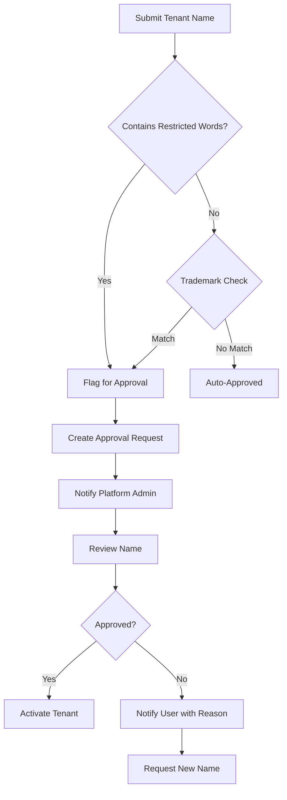

# Approval Process

> **Purpose**: Document approval processes for tenant names and other restricted operations  
> **Scope**: Name approval, manual review, approval workflows

---

## Overview

Certain operations require manual approval to ensure compliance, prevent abuse, and maintain quality. This document outlines the approval processes for various scenarios, particularly focusing on tenant name approvals.

---

## Tenant Name Approval Process

### When Approval is Required

Approval is required when:
- Name contains restricted words or trademarks
- Name is flagged by automated screening
- Name requires verification of authorization (e.g., official organization names)
- Name matches known brands or entities

```typescript
interface ApprovalCriteria {
  requiresApproval: boolean;
  reason: ApprovalReason;
  restrictedWords?: string[];
  verificationRequired?: boolean;
}

enum ApprovalReason {
  CONTAINS_RESTRICTED_WORD = 'contains_restricted_word',
  BRAND_MATCH = 'brand_match',
  POTENTIAL_TRADEMARK = 'potential_trademark',
  VERIFICATION_REQUIRED = 'verification_required',
  MANUAL_REVIEW = 'manual_review'
}
```

### Approval Workflow



### Implementation

```typescript
async function createTenantWithApproval(
  data: CreateTenantDto
): Promise<TenantCreationResult> {
  // 1. Validate name
  const nameCheck = await validateTenantName(data.name);
  
  if (nameCheck.requiresApproval) {
    // Create pending approval
    const approval = await approvalService.create({
      type: 'tenant_name',
      tenantData: data,
      reason: nameCheck.approvalReason,
      status: ApprovalStatus.PENDING
    });
    
    // Notify platform admins
    await notificationService.notifyPlatformAdmins({
      type: 'approval_required',
      approvalId: approval.id,
      tenantName: data.name,
      reason: nameCheck.approvalReason
    });
    
    // Return pending status
    return {
      success: true,
      status: TenantCreationStatus.PENDING_APPROVAL,
      approvalId: approval.id,
      estimatedTime: '24-48 hours'
    };
  }
  
  // Auto-approved, create tenant
  const tenant = await tenantService.create(data);
  return {
    success: true,
    status: TenantCreationStatus.APPROVED,
    tenantId: tenant.id
  };
}
```

### Approval Processing

```typescript
async function processApproval(
  approvalId: ApprovalId,
  decision: ApprovalDecision,
  reason?: string,
  approvedBy: UserId
): Promise<void> {
  const approval = await approvalRepo.findById(approvalId);
  
  if (approval.status !== ApprovalStatus.PENDING) {
    throw new Error('Approval already processed');
  }
  
  if (decision === ApprovalDecision.APPROVED) {
    // Create tenant
    const tenant = await tenantService.create(approval.tenantData);
    
    // Update approval
    approval.approve(approvedBy);
    await approvalRepo.save(approval);
    
    // Notify user
    await notificationService.notifyUser(approval.userId, {
      type: 'tenant_approved',
      tenantId: tenant.id,
      message: 'Your tenant name has been approved'
    });
  } else {
    // Reject
    approval.reject(approvedBy, reason);
    await approvalRepo.save(approval);
    
    // Notify user
    await notificationService.notifyUser(approval.userId, {
      type: 'tenant_rejected',
      reason,
      message: 'Your tenant name requires changes'
    });
  }
}
```

---

## Restricted Words Management

### Restricted Words Categories

```typescript
interface RestrictedWord {
  word: string;
  category: RestrictedCategory;
  severity: Severity;
  reason: string;
}

enum RestrictedCategory {
  TRADEMARK = 'trademark',
  BRAND = 'brand',
  OFFENSIVE = 'offensive',
  MISLEADING = 'misleading',
  RESERVED = 'reserved'
}

enum Severity {
  LOW = 'low',      // Auto-approve with flag
  MEDIUM = 'medium', // Requires review
  HIGH = 'high'     // Requires manual approval
}
```

### Restricted Words Database

```typescript
class RestrictedWordsService {
  private restrictedWords: RestrictedWord[] = [];
  
  async loadRestrictedWords(): Promise<void> {
    this.restrictedWords = await this.restrictedWordRepo.findAll();
  }
  
  checkName(name: string): RestrictedWord[] {
    const matches: RestrictedWord[] = [];
    
    for (const word of this.restrictedWords) {
      if (name.toLowerCase().includes(word.word.toLowerCase())) {
        matches.push(word);
      }
    }
    
    return matches;
  }
  
  getRequirementLevel(matches: RestrictedWord[]): ApprovalRequirement {
    if (matches.length === 0) {
      return ApprovalRequirement.NONE;
    }
    
    const hasHigh = matches.some(m => m.severity === Severity.HIGH);
    if (hasHigh) {
      return ApprovalRequirement.MANDATORY;
    }
    
    const hasMedium = matches.some(m => m.severity === Severity.MEDIUM);
    if (hasMedium) {
      return ApprovalRequirement.REVIEW;
    }
    
    return ApprovalRequirement.FLAG;
  }
}
```

---

## Approval Queue Management

### Approval Queue

```typescript
interface ApprovalQueue {
  items: ApprovalRequest[];
  sortBy: SortCriteria;
  filter: ApprovalFilter;
}

interface ApprovalRequest {
  id: ApprovalId;
  type: ApprovalType;
  submittedAt: Date;
  submittedBy: UserId;
  data: any;
  status: ApprovalStatus;
  priority: Priority;
  estimatedReviewTime: number;
}

enum Priority {
  LOW = 'low',
  MEDIUM = 'medium',
  HIGH = 'high',
  URGENT = 'urgent'
}
```

### Queue Processing

```typescript
async function processApprovalQueue(): Promise<void> {
  const queue = await approvalRepo.getQueue({
    status: ApprovalStatus.PENDING,
    priority: Priority.URGENT,
    sortBy: 'submittedAt',
    limit: 50
  });
  
  for (const request of queue) {
    // Assign to available reviewer
    const reviewer = await findAvailableReviewer();
    if (!reviewer) {
      continue; // Skip if no reviewer available
    }
    
    // Assign request
    await assignApprovalRequest(request.id, reviewer.id);
    
    // Notify reviewer
    await notificationService.notifyReviewer(reviewer.id, {
      type: 'approval_assigned',
      requestId: request.id,
      urgency: request.priority
    });
  }
}
```

---

## Approval SLA and Metrics

### Service Level Agreements

```typescript
interface ApprovalSLA {
  tenantNameApproval: {
    standard: '24 hours';
    expedited: '4 hours';
    urgent: '1 hour';
  };
  
  priorityMapping: {
    [Priority.LOW]: 48,    // hours
    [Priority.MEDIUM]: 24,
    [Priority.HIGH]: 8,
    [Priority.URGENT]: 1
  };
}
```

### Approval Metrics

```typescript
interface ApprovalMetrics {
  totalRequests: number;
  pendingRequests: number;
  approvedRequests: number;
  rejectedRequests: number;
  averageProcessingTime: number;
  slaCompliance: number;
  
  byCategory: Record<string, {
    count: number;
    approvalRate: number;
    averageTime: number;
  }>;
}
```

---

## Automation Rules

### Auto-Approval Rules

```typescript
interface AutoApprovalRule {
  conditions: ApprovalCondition[];
  action: AutoApprovalAction;
  confidence: number;
}

async function checkAutoApproval(
  approval: ApprovalRequest
): Promise<AutoApprovalResult> {
  const rules = await getAutoApprovalRules();
  
  for (const rule of rules) {
    if (matchesConditions(approval, rule.conditions)) {
      if (rule.confidence >= 0.9) {
        // High confidence, auto-approve
        return {
          autoApprove: true,
          rule: rule.name,
          confidence: rule.confidence
        };
      } else if (rule.confidence >= 0.7) {
        // Medium confidence, suggest approval
        return {
          autoApprove: false,
          suggestApprove: true,
          rule: rule.name,
          confidence: rule.confidence
        };
      }
    }
  }
  
  return { autoApprove: false };
}
```

---

## Related Documentation

- [Validation Rules](./validation-rules.md)
- [Business Constraints](./constraints.md)
- [Edge Cases](./edge-cases.md)
